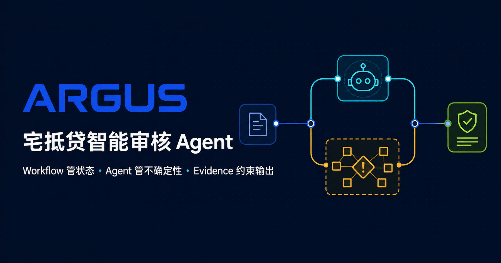
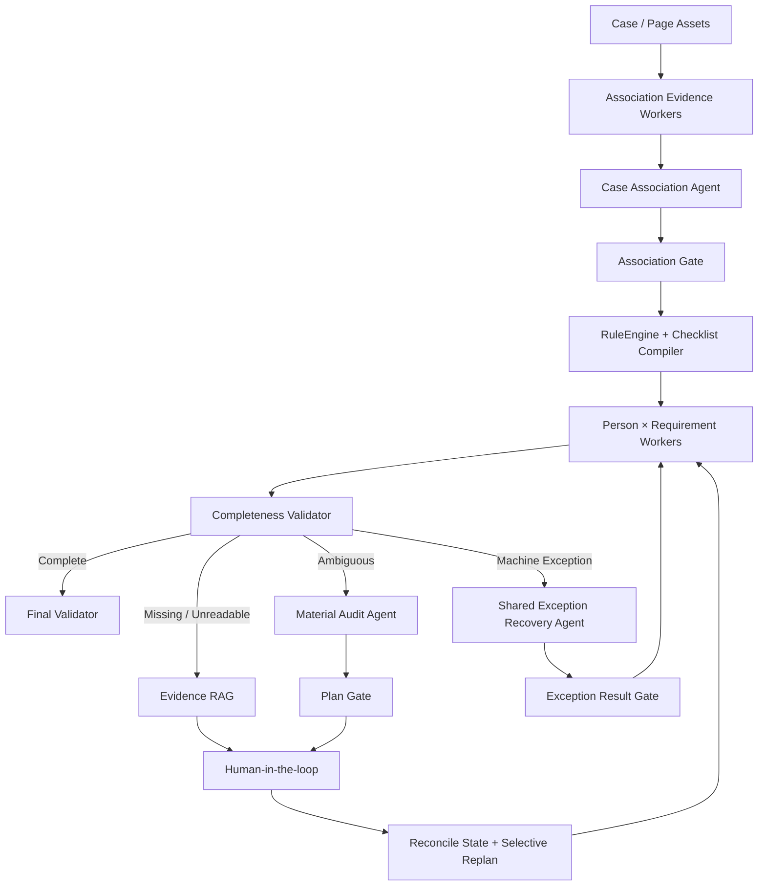

# ARGUS · 银行进件材料齐套审核 Agent

ARGUS 是一个面向宅抵贷等多人员、多影像进件场景的可运行 Agent 原型。它根据已确认的人员角色动态生成材料清单，并判断材料是否到齐、可读且归属明确。

> 项目边界：ARGUS 只做“材料齐套审核”，不做授信准入、额度、估值、风险定价或最终审批。



## 为什么做这个项目

银行进件往往包含数百页影像，又涉及借款人、配偶、抵押人等多个角色。纯规则容易被材料歧义和 OCR 异常卡住，纯 Agent 又难以满足金融场景的稳定性、可追溯性和人工兜底要求。

ARGUS 采用“确定性 Workflow 控制主线，Agent 只处理局部不确定性”的设计：

- RuleEngine 确定性生成 `Person × Requirement` 动态清单；
- Case Association Agent 在封闭候选集内判断人员与材料归属；
- Material Audit Agent 只处理材料类型、跨页分组等语义歧义；
- Exception Recovery Agent 在受控 Tool Loop 中恢复 OCR、VLM 或检索异常；
- 模型输出必须经过 Pydantic 和业务 Gate，才能写入 Case State；
- 无法可靠自动决策时，通过 Checkpoint + HITL + Selective Replan 转人工并继续原流程。

## 核心架构



这里没有一个可以自由改写全局状态的“超级 Agent”。Worker 只读并产生候选结果，主图中的 Gate 是唯一业务提交点。

## 技术亮点

### 1. 受控 Agent，而不是自由对话

- 两个业务决策 Agent 都是一次结构化决策，不直接调用工具；
- 异常 Agent 每轮根据最新 Observation 动态重建 2～4 个任务级候选工具；
- 内置 Tool Allowlist、Max Step、Max Retry、Duplicate Action 和 State No-change 守卫；
- 每个决策保留 Evidence Ref、Prompt Version、Model Signature 和审计事件。

### 2. 两条职责分离的 RAG 链路

- **Requirement Evidence RAG**：在 Requirement ID 已知时，只为缺件结论绑定可引用的制度依据；
- **Knowledge QA RAG**：支持材料要求查询和来源追溯，包含 Clarify / Refuse 边界。

在线检索链路：

```text
Query Rewrite
→ Metadata Pre-filter
→ BGE-M3 Dense + Milvus BM25
→ RRF Fusion
→ Cross-Encoder Rerank
→ Parent Context Expansion
→ Grounding + Citation Validator / Refuse
```

当前可复现的演示语料包含：

| 资产 | 规模 |
| --- | ---: |
| 官方来源 | 12 |
| Parent Chunks | 19 |
| Semantic Child Chunks | 187 |
| Atomic Requirements | 77 |
| Retrieval Golden Cases | 50 |

### 3. Long-horizon 恢复与人机协作

LangGraph Checkpoint 保存流程状态，Case/Event SQLite 保存业务投影与审计日志。人工确认后，系统不是简单从旧节点重跑，而是先对账、失效受影响任务，然后只重规划 Dirty Tasks。

SSE 支持 `Last-Event-ID` 断线续读，前端展示结构化决策、Tool Observation、Evidence 和 State Diff，不暴露模型思维链。

### 4. 可回归的 Eval Harness

Agent 评测不只看最后一句输出，而是评分完整轨迹和最终持久化结果：

- 同一 Case 多 Trial，同时检查平均质量、最差 Trial 和 Outcome Stability；
- 关闭服务并重开 SQLite 后，以 Final DB Outcome 而非内存输出评分；
- Baseline / Challenger 按相同 Case 和 Trial 做配对 Shadow Replay；
- 用 2,000 次 Paired Bootstrap 和绝对质量门槛阻断回归。

已提交的 Retrieval Baseline：

| Metric | Result | Gate |
| --- | ---: | ---: |
| HitRate@5 | 1.000 | ≥ 0.95 |
| Recall@5 | 1.000 | ≥ 0.95 |
| MRR | 0.932 | ≥ 0.60 |
| NDCG@5 | 0.949 | ≥ 0.75 |

> 这些数字来自小型演示 Golden Set，用于验证评测方法和回归门禁，不代表真实生产流量的效果。

### 5. 人工反馈数据闭环

```text
Candidate Impression
→ Agent Decision
→ Human Confirmation / Override
→ Versioned Hard Case
→ Offline Eval or Training
→ Shadow Replay + Bootstrap Gate
```

人工反馈不会直接在线更新模型。当前实现了候选曝光、人工标签、Hard Case 重建和 JSONL 导出；后续可用于候选排序与置信度校准。

## 技术栈

| 层 | 技术 |
| --- | --- |
| Frontend | React 19, TypeScript, Tailwind CSS, shadcn/ui |
| API | FastAPI, Pydantic, resumable SSE |
| Orchestration | LangGraph, Checkpoint, interrupt/resume, Send/Fan-in |
| Persistence | SQLite Case/Event Store, LangGraph Checkpoint Store |
| Retrieval | BGE-M3, Milvus Dense + BM25, RRF, Cross-Encoder |
| Model Access | Provider-neutral ModelGateway, role routing, retry and fallback |
| Evaluation | Golden Set, multi-Trial, Shadow Replay, paired Bootstrap |

## 快速启动

### 环境要求

- Python 3
- Node.js 22.13+
- npm
- Docker（仅完整 Milvus RAG 链路需要）

### 1. 初始化

```bash
git clone <your-repository-url>
cd audit-agent-demo
cp .env.example .env
make init
```

### 2. 启动主演示

```bash
make demo
```

- Web：<http://localhost:3000>
- OpenAPI：<http://127.0.0.1:8000/docs>
- Health：<http://127.0.0.1:8000/health>

### 3. 构建完整 RAG 链路

```bash
make rag-install
docker compose up -d
make rag-build
make rag-online-smoke
```

`.env.example` 列出了 ModelGateway、Milvus、OCR/VLM 和外部材料检索服务的配置项。真实密钥只应存放在本地 `.env` 或 Secret Manager 中。

## 验证

```bash
# 确定性单测 + 前端构建测试
make test

# 单测 + Retrieval Eval + Agent Multi-Trial Eval + Lint
make verify

# 单独运行评测
make rag-eval
make agent-eval
make rag-answer-eval

# 导出人工确认数据
make feedback-export
```

查看由实际 LangGraph 反射生成的主图：

```bash
make describe
```

## 目录结构

```text
app/                         React 工作台
backend/app/orchestration/   唯一 LangGraph 主图与 Stage
backend/app/agents/          Association / Audit / Exception Agents
backend/app/tools/           Local + MCP Tool Registry 与执行边界
backend/app/rag/             Offline Build + Online Retrieval
backend/app/evaluation/      Harness, Outcome, Feedback, Regression Gate
backend/evals/               Golden Sets 与 Baselines
backend/scripts/             构建、冒烟、评测与导出脚本
demo/                        与生产主图隔离的合成数据
docs/                        架构、RAG 和 Eval 运行手册
```

## 进一步阅读

- [架构导览](./docs/ARCHITECTURE.md)
- [RAG 运行手册](./docs/RAG_RUNBOOK.md)
- [Eval Harness 与数据闭环](./docs/EVAL_HARNESS.md)
- [完整实施记录](./replan.md)

## 当前限制

- 仓库数据是演示数据，还没有用真实银行生产流量做压测或效果验证；
- Demo 中的 7 个材料任务没有依赖关系，架构已支持依赖解析；
- 复杂表格、跨页表头和外部副作用工具的持久化幂等仍需生产化补强；
- 候选排序和置信度校准是数据闭环的下一步，尚未宣称已训练或上线。
