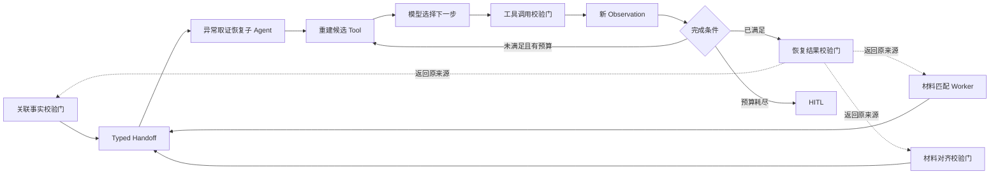
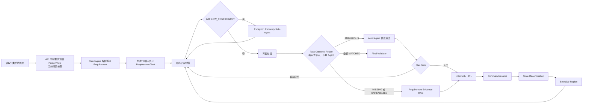
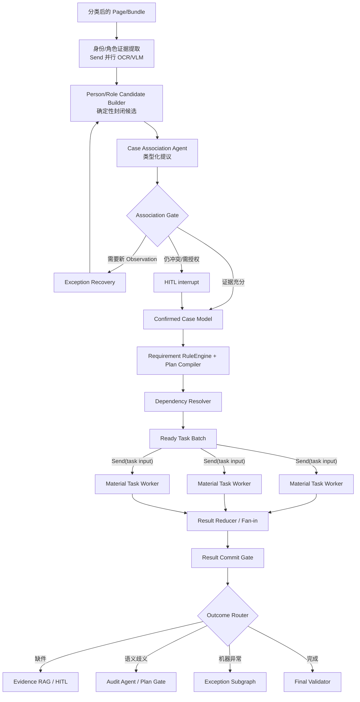
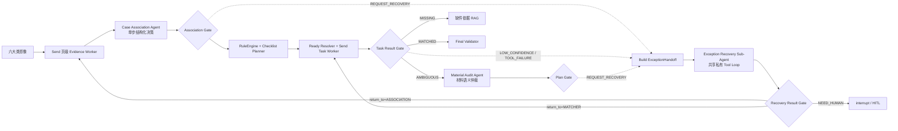

# ARGUS Replan：中文化 Agent 演示与可解释回程

> 版本：2026-08-19 UI Replan  
> 状态：**已实施并通过全量回归（2026-08-19）**  
> 当前唯一实施基线：本节优先级高于文末历史计划；本轮只重构展示模型、运行检查器和必要的可观察事件，不改变“1 个确定性主图 + 2 个受控决策 Agent + 1 个共享恢复子 Agent”的后端架构。  
> 业务边界：系统只审核对应人员的材料是否到齐、可读且归属明确，不做贷款准入、风险、额度、估值或是否放款判断。

## 1. 本轮结论

当前功能已经具备面试价值，主要问题不是 Agent 数量不够，而是前端没有把价值按业务因果关系讲出来：

1. 架构演进页已经存在两个决策 Agent，但英文名称占据视觉主位，面试官需要先翻译术语，再理解它们分别解决什么问题。
2. V2 虽然画出了两个 Agent，却没有把完整闭环强调出来：**为什么规则失败 → Workflow 构造什么候选 → Agent 选择什么 → Gate 校验什么 → 回写后继续哪个节点**。
3. V3 已经画出异常循环，但“来源、循环、回程”在同一视觉层混在一起，回到哪个原 Task 不够明确。
4. 材料审核右栏显示 `Task Ledger / CONTROL / Case Association / Audit Agent` 等混合语言；Task 主标题还是 ID，业务任务是什么不直观。
5. 当前 Replan 只显示“复用几个、失效几个”，没有显示恢复自哪个 Checkpoint、补件改变了什么事实、依赖如何命中、旧结果为什么保留或失效、Dirty Task 如何重新派发。
6. 右栏大量文字只有 7–10px，不适合面试投屏。动态信息虽多，但没有形成“当前任务 → Agent 介入原因 → 结构化提议 → Gate → State Diff”的主叙事。

本轮设计结论：

- **中文业务名做主标题，稳定英文标识做次要代码标签。** 不修改 Python 类名、LangGraph Node ID、Event Type、Task ID 和 Prompt ID。
- **两个决策 Agent 必须显示在主 Workflow 的不同生命周期位置。** 不能画成三个 Agent 自由对话。
- **把“异常回程”和“补件重规划”拆成两种动画。** 前者是带新 Observation 返回原 Task 重试；后者是从暂停 Checkpoint 恢复后做 State Reconciliation 与 Selective Replan，不称为回滚旧节点。
- **右侧从技术日志改成审核任务解释器。** 第一眼先回答“正在审核什么、为什么需要 Agent、Agent 做了什么、Gate 是否允许写入”。

## 2. 中文命名规范

### 2.1 三个 Agent 的展示名称

| 稳定代码名称 | 中文主名称 | 中文职责副标题 | 为什么这样命名 |
| --- | --- | --- | --- |
| `Case Association Agent` | **进件事实关联 Agent** | 人员归并 · 角色绑定 · 材料归属 | 不只关联人员和角色，还产出页面所属人的可信事实；“事实关联”比“案件关联”更准确 |
| `Material Audit Agent` | **材料语义仲裁 Agent** | 所属人 · 材料类型 · 跨页成册 · 清单项对齐 | 明确它只处理 Matcher 后的语义歧义，不生成清单、不审批贷款 |
| `Exception Recovery Sub-Agent` | **异常取证恢复子 Agent** | 动态选 Tool · 多步补证 · 有界循环 | 它补充 Observation，而不是替业务做最终决定；“取证恢复”比“异常处理”更能体现 Tool Loop 价值 |

显示规则：

```text
进件事实关联 Agent
人员归并 · 角色绑定 · 材料归属
CASE ASSOCIATION AGENT            ← 10–11px 次级代码标签
```

### 2.2 Workflow、Task 与 Gate 的中文映射

| 当前显示 | 新的主显示 | 保留的小标签 |
| --- | --- | --- |
| Case Association | 进件事实关联 | `case_association` |
| Association Gate | 关联事实校验门 | `Association Gate` |
| RuleEngine | 应交清单规则引擎 | `RuleEngine` |
| Requirement 清单 | 应交材料清单 | `Requirement` |
| Task Plan | 审核任务计划 | `Task Plan` |
| Task Orchestrator | 任务编排器 | `Send / Worker` |
| Task Ledger | 审核任务账本 | `Task Ledger` |
| Material Audit Agent | 材料语义仲裁 Agent | `Material Audit Agent` |
| Plan Gate | 材料对齐校验门 | `Plan Gate` |
| Fan-in Plan Gate | 并行结果汇聚门 | `Fan-in Gate` |
| Exception Result Gate | 恢复结果校验门 | `Result Gate` |
| Selective Replan | 选择性重规划 | `Selective Replan` |
| Checkpoint Spine | 暂停与恢复轨迹 | `Checkpoint` |
| Human in the Loop | 人工介入 | `HITL` |

### 2.3 不翻译或只做辅助翻译的术语

以下术语保留：`LangGraph`、`Workflow`、`Agent`、`Sub-Agent`、`Tool`、`Worker`、`Send`、`Fan-in`、`Checkpoint`、`thread_id`、`HITL`、`SSE`、`RAG`、`OCR`、`VLM`。

以下业务枚举不直接暴露为主文案：

- `BORROWER` → 借款人
- `MORTGAGOR` → 抵押人
- `SPOUSE` → 配偶
- `MATCHED` → 已匹配
- `MISSING` → 缺件
- `AMBIGUOUS` → 语义待仲裁
- `UNREADABLE` → 影像不可读
- `DIRTY` → 等待重新执行
- `INVALIDATED` → 旧结果已失效
- `KEEP` → 保留原结果
- `RERUN` → 重新执行

英文枚举只在 Task 详情的“技术标识”区展示，不能再成为卡片主标题。

## 3. 架构演进页重新设计

### 3.1 页面单一目标

这一页不是架构文档浏览器，而是一段三步面试讲解：

> 确定性 Workflow 先解决能确定的问题；两个决策 Agent 分别补上事实入口和材料匹配后的语义判断；共享异常子 Agent 在 Observation 不足时动态选 Tool，并把结果安全送回原任务。

页面继续保留 V1、V2、V3 三步点击演示，不增加 Quick Tour、Deep Dive 或更多 Tab。

### 3.2 V1：确定性 Workflow 的能力和边界

主链改为中文：

```text
六大类影像
→ 应交清单规则引擎
→ 审核任务计划
→ Send 并行匹配
→ 并行结果汇聚门
→ Task 结果路由
```

在主链上放两个清晰的阻断标记：

1. 规则引擎前：**人员、角色和页面归属尚未形成可信事实**。
2. Matcher 后：**已有材料无法唯一对齐到人员、类型、跨页分组或应交项**。

点击“生成下一版”时，不只是出现新节点，而是两个阻断标记分别展开为 Agent 插槽，让升级原因和 Agent 位置一一对应。

### 3.3 V2：两个决策 Agent 的完整闭环

V2 不再只显示 Agent 名称，必须显示两个完整的“受控决策胶囊”：

```text
【事实入口】
页级身份/角色/归属证据
→ Workflow 构造封闭候选
→ 进件事实关联 Agent
→ 关联事实校验门
→ 确认人员、角色、页面归属
→ 应交清单规则引擎

【材料匹配后】
当前歧义 Task + 问题页 + 当前 Plan 允许组合
→ Workflow 构造封闭候选
→ 材料语义仲裁 Agent
→ 材料对齐校验门
→ 写入页面归属/类型/清单项
→ 回到 Matcher 重新匹配
```

每个 Agent 卡必须固定显示四个字段：

- **为什么调用**：确定性规则无法唯一选择。
- **最小上下文**：候选数、页面数、当前 Case/Plan Version。
- **结构化动作**：应用候选 / 请求取证恢复 / 请求人工。
- **写入边界**：Agent 无写权限，Gate 才能提交 State Diff。

这四项比模型名称和 Prompt 文字更能体现 Agent 设计能力。

### 3.4 V3：共享异常取证循环和精确回程

V3 采用“来源区—恢复子图—回程区”三段结构：



唯一主动画设计为一次可解释的“任务回程”：

1. 一个真实来源 Task 高亮，例如“配偶婚姻证明归属待确认”。
2. Typed Handoff 沿连接线进入异常子图，显示来源、Task、页范围、异常类型、版本和 Return Target。
3. 循环内逐轮显示“候选 Tool → 模型动作 → Tool Gate → Observation → 完成条件”。
4. 成功后，绿色回程脉冲沿明确的 Return Target 回到原 Task，原 Task 从“等待取证”变成“重新匹配”。
5. 失败时不画回程，转到“人工介入，Checkpoint 已持久化”。

禁止用无限循环流光。动画只由真实事件推进，每个事件只播放一次；`prefers-reduced-motion` 下改成静态步骤点亮。

### 3.5 架构页要突出什么“含金量”

面试官在 V3 结束时应能直接看到五点：

1. **Agent 放置有理由**：两个决策 Agent 分别位于事实入口和匹配后，不是为了凑 Multi-Agent。
2. **上下文被控制**：只给封闭候选和任务范围，不把 200+ 页全部塞入 Prompt。
3. **写权限被控制**：Agent 只提议，Gate 校验版本、范围和 Evidence 后写 State。
4. **异常处理不是固定 OCR 重试**：每轮根据新 Observation 重建 2–4 个候选 Tool。
5. **回程可验证**：Typed Handoff 携带 Return Target，Result Gate 将结果送回发起它的原 Task。

## 4. 材料审核右侧运行检查器

### 4.1 中文任务名称

右栏 Task 不再以 `TASK-XXX-P02` 为主标题。展示名称由当前 State 投影得到：

```text
配偶 · 婚姻证明齐套核验
应交项：南京分行婚姻状况证明材料
等待重新执行                         [RERUN]
TASK-NJ-MARRIAGE-P02                 ← 仅作次级技术标识
```

任务中文名称优先使用：

1. `state.requirements[].title` 作为“应交项名称”；
2. `state.persons[].name + roleLabels` 作为责任人；
3. `materialLabels[material_type]` 作为材料名；
4. 组合为“角色/人员 · 材料名齐套核验”；
5. 找不到映射时使用明确中文回退“未知材料类型”，不把原始枚举直接顶到主标题。

后端 `task_id / requirement_id / material_type / person_role` 保持不变，保证 Checkpoint、SSE 重放和测试稳定。

### 4.2 右栏信息顺序

右栏改为四层，正常屏幕页面不整体滚动，仅右栏内部滚动：

```text
┌─ LangGraph 运行状态 ─────────────────────┐
│ 当前：材料语义仲裁                       │
│ 进件版本 C2 · 计划版本 P2 · 任务 4/7     │
├─ 当前任务：配偶 · 婚姻证明齐套核验 ─────┤
│ 为什么调用 Agent：两个页面均可匹配       │
│ 输入边界：2 页 / 3 候选 / P2             │
│ Agent 提议：应用候选 02                   │
│ Gate：5/5 校验通过 → 写入后重新匹配       │
├─ 审核任务账本 ───────────────────────────┤
│ 已匹配 4 / 缺件 1 / 待仲裁 1 / 重跑 1    │
│ [中文任务行……]                           │
├─ 技术详情（折叠）────────────────────────┤
│ Task ID / Requirement ID / Event Type     │
└───────────────────────────────────────────┘
```

正常运行时只展开“当前任务”。其他 Task 显示中文名、状态和执行者摘要；点击任务后才展开依赖、Evidence、版本和技术 ID。

### 4.3 Agent 处理卡

两个决策 Agent 的运行卡统一为：

```text
材料语义仲裁 Agent
原因：所属人与应交项存在多个有效候选

Workflow 候选       3 个
Agent 结构化提议     应用候选 02
材料对齐校验门       5/5 通过
State Diff           PAGE-028.owner → P02
下一步               返回 Matcher 重新匹配
```

异常子 Agent 的运行卡统一为：

```text
异常取证恢复子 Agent · 第 2/4 步
当前问题：OCR 低置信度，姓名字段冲突
可用 Tool：VLM 图文复核 / 相邻页检索 / 进件材料检索
本轮选择：VLM 图文复核
Observation：新增姓名与印章位置证据，State 已变化
完成条件：仍缺独立材料佐证 → 继续下一轮
```

只显示可观察的结构化决策、Tool Observation 和完成条件，不显示 Chain of Thought、完整 Prompt、原始 JSON 或敏感信息。

## 5. “回退”与 Selective Replan 的重新设计

### 5.1 先纠正概念

前端禁止笼统显示“回退到旧节点”。实际有两种不同机制：

| 场景 | 正确名称 | 版本变化 | 展示重点 |
| --- | --- | --- | --- |
| Exception 获得新 Observation | **返回原任务重试** | 通常不切换到任意历史 State | Handoff 来源、Return Target、Result Gate、原 Task 重试 |
| 人工修改或跨天补件 | **从暂停 Checkpoint 恢复并选择性重规划** | Case Version、Plan Version 递增 | Changed Fact、Dependency 命中、KEEP/RERUN、Dirty Task 派发 |

Time Travel/Replay 是调试能力，不进入正常补件演示话术。

### 5.2 Replan 主视图：恢复因果链

当出现补件恢复事件时，右栏临时切换到“恢复与重规划”主视图：

```text
暂停检查点 CP-0002
WAITING_SUPPLEMENT · Plan P1 · TASK-MARRIAGE-P02
        ↓ Command(resume) / same thread_id
应用补件 PAGE-217
婚姻证明 · 所属人 P02
        ↓
事实对账
新增 page:PAGE-217
变化 person:P02 / material:marriage_certificate
        ↓
依赖影响分析
7 个 Task 中 1 个命中 Changed Fact
        ↓
选择性重规划 P1 → P2
6 个保留原结果 / 1 个旧结果失效并重跑
        ↓
重新派发 Dirty Task
配偶 · 婚姻证明齐套核验：R1 → R2
```

每一步必须来自真实 SSE Event，不使用前端计时器伪造进度。

### 5.3 Task Before / After 差异表

Replan 不再只显示两个计数 Badge，而是显示任务级差异：

| 中文任务 | 旧结果 | 依赖命中原因 | 决策 | 新状态 |
| --- | --- | --- | --- | --- |
| 借款人 · 身份证明齐套核验 | R1 已匹配 | 未命中变化事实 | 保留原结果 | R1 沿用 |
| 配偶 · 婚姻证明齐套核验 | R1 缺件 | `person:P02`、`material:marriage_certificate` | 旧结果失效 | R2 重新执行 |
| 抵押人 · 不动产权属证明核验 | R1 已匹配 | 未命中变化事实 | 保留原结果 | R1 沿用 |

点击某行后联动显示：

- Changed Fact；
- Task 的 `fact_dependencies / task_dependencies`；
- 命中的依赖交集；
- 旧 Result Version 与新 Result Version；
- 是否重新进入材料语义仲裁 Agent；若证据已明确，显示“跳过 Agent：确定性匹配已足够”。

### 5.4 动画规范

- 恢复轨迹只允许一个主动动画：当前步骤点亮并向下一步推进。
- KEEP 任务原地保持，不移动；RERUN 任务从旧结果淡出到“等待重新执行”，新结果返回后更新 R1 → R2。
- 颜色不单独承担语义：保留原结果使用对勾和“保留”，重新执行使用旋转箭头和“重跑”，人工介入使用人形图标和“HITL”。
- 正文不得低于 12px，技术标识不得低于 10px；投屏关键标题建议 13–15px。
- 支持 `prefers-reduced-motion`，禁用无限闪烁和持续旋转。

## 6. 展示模型与代码边界

### 6.1 新增统一展示层

新增：

```text
app/features/material-audit/presentation/
  labels.ts              # Node、Event、Status、Role、Material、Action、Tool 中文映射
  task-presentation.ts   # 由 CaseState + Requirement + Task 生成中文任务视图
  trace-presentation.ts  # 将结构化 Trace 转成面试可读摘要，不改原事件
```

当前 `MaterialWorkbench.tsx` 和 `ExecutionInspector.tsx` 内重复的 `roleLabels / materialLabels / statusLabels / nodeLabels` 迁到统一展示层。禁止在多个组件继续维护不同中文翻译。

展示层合同建议：

```ts
interface TaskPresentation {
  title: string;               // 配偶 · 婚姻证明齐套核验
  requirementTitle: string;    // 南京分行婚姻状况证明材料
  statusLabel: string;         // 等待重新执行
  executorLabel: string;       // 材料匹配 Worker
  technicalId: string;         // TASK-...
}

interface AgentStepPresentation {
  agentLabel: string;
  invocationReason: string;
  candidateSummary: string;
  decisionLabel: string;
  gateChecks: Array<{ label: string; passed: boolean }>;
  stateDiffSummary: string;
  nextRouteLabel: string;
}
```

### 6.2 事件 Projection 补强

`projection.ts` 保持只读 Event Projection，但扩展以下结构：

- `activeTaskJourney`：任务中文名、当前节点、调用 Agent 的原因、下一跳；
- `returnJourney`：Handoff Origin、Return Target、Result Gate 结果、返回的 Task ID；
- `checkpointSummary`：CP ID、暂停节点、Case/Plan Version、Task 状态摘要；
- `replanDiff`：before/after Plan Version、Changed Facts、每个 Task 的 KEEP/RERUN、依赖命中原因、Result Version；
- `agentGateChecks`：版本、候选范围、页面范围、人员范围、Evidence 范围的通过/失败结果。

若现有事件缺少“Task 为什么被影响”，后端 `reconciliation.selective_replan` 在每条 `TASK_RESULT_REUSED / INVALIDATED` Observation 中增加：

```text
matched_changed_facts
matched_fact_dependencies
before_result_version
after_result_version
```

前端不能复制一套影响分析业务规则来猜原因。

### 6.3 主要修改文件

| 文件 | 计划修改 |
| --- | --- |
| `ArchitectureStage.tsx` | 三版本中文文案、两个 Agent 决策胶囊、V3 来源/循环/回程图 |
| `ExecutionInspector.tsx` | 中文任务账本、当前 Agent 处理卡、恢复与 Replan 主视图 |
| `projection.ts` | Return Journey、Gate Checks、Replan Diff 的事件投影 |
| `MaterialWorkbench.tsx` | 复用统一中文标签，Requirement 清单改为应交材料清单 |
| `app/globals.css` | 提升右栏字号、恢复轨迹和 Task Diff 样式、Reduced Motion |
| `backend/app/orchestration/stages/reconciliation.py` | 仅在必要时补充任务影响原因事件，不改变重规划算法 |
| `backend/app/orchestration/stages/recovery.py` | 确认 Handoff/Result 事件包含 Origin、Return Target 和 Task ID |
| `tests/rendered-html.test.mjs` | 中文主名称、禁止旧英文主标题、字号和一屏门禁 |
| `tests/material-audit.e2e.cjs` | 两 Agent 路径、异常回程、Checkpoint Resume、KEEP/RERUN 动态断言 |

## 7. 实施顺序

### P0：统一命名与任务中文化

- [x] 新建集中式中文展示词典；迁移当前重复 label map。
- [x] 架构页三个 Agent 使用中文主名和英文次级代码名。
- [x] 右栏 `Task Ledger` 改为“审核任务账本”，Task 主标题改为中文业务任务。
- [x] `Requirement 清单` 改为“应交材料清单”，Requirement ID 只作次级标识。
- [x] 所有状态、角色、材料类型、执行者和常见动作显示中文。
- [x] 删除可见的 `CONTROL / STATE / TASK / Ready Batch` 等无解释英文主标签。

### P1：两个决策 Agent 的演示闭环

- [x] V2 显示两条完整路径：调用原因 → 封闭候选 → Agent 提议 → Gate → State Projection → 下一跳。
- [x] 运行检查器为当前 Agent 展示调用原因、候选范围、结构化动作和 Gate 校验项。
- [x] 明确材料语义仲裁 Agent 只处理 AMBIGUOUS，不负责生成清单或判断缺件。
- [x] 明确进件事实关联 Agent 位于 RuleEngine 前，确认事实后才生成应交清单。

### P2：异常回程动画

- [x] V3 拆成三个异常来源、一个共享恢复子图和精确 Return Target。
- [x] 新增 returnJourney Projection，运行态完全由真实事件推进。
- [x] 显示每轮候选 Tool、选择、Tool Gate、Observation、完成条件和剩余预算。
- [x] 成功回原 Task 重试；失败进入 Checkpoint + HITL，不显示模糊“回退”。

### P3：Checkpoint 与 Replan 可解释化

- [x] 恢复轨迹显示 CP ID、暂停状态、同一 thread_id 恢复、补件 Patch 和版本变化。
- [x] 显示 Changed Fact → Dependency 命中 → Task KEEP/RERUN 的因果链。
- [x] Replan 增加任务级 Before/After 表，不只显示汇总数字。
- [x] Dirty Task 重跑后显示 Result Version 变化；确定性 Worker 已完成时显示未进入仲裁 Agent。
- [x] 后端补充任务影响原因事件字段，但不改变现有 Selective Replan 算法。

### P4：布局与验证

- [x] 保持一屏 Shell；架构和工作台只允许内部面板滚动，1440×900 E2E 继续作为门禁。
- [x] 扩大右栏默认宽度并提升 Agent、Task、Checkpoint、Gate 和 Replan 关键字号。
- [x] 运行真实 Demo Case，验证两个 Agent、Exception Loop、HITL 和 Replan 全链路文案。
- [x] 保留 Reduced Motion、键盘焦点、空状态、错误状态和 Last-Event-ID 重连门禁。
- [x] 前端 lint/build/render 与后端 107 项全量测试通过；E2E 脚本已更新中文和 Replan 断言。

## 8. 最终验收场景

### 场景 A：两个决策 Agent 的位置和价值

面试官点击 V1 → V2 后，无需讲解就能看到：

- 进件事实关联 Agent 解决人员、角色、材料归属；
- 材料语义仲裁 Agent 解决匹配后的材料候选歧义；
- 两者都是封闭候选、单次结构化提议、Gate 写入；
- 两者不自由对话，也不是 Tool Loop。

### 场景 B：异常取证恢复

以一个 OCR 低置信或跨页冲突 Task 演示：

- 清楚显示异常来自哪个 Task；
- 每轮只暴露当前有价值的候选 Tool；
- Tool Observation 改变后重新构建候选；
- 完成条件满足后通过 Result Gate 返回原 Task；
- 超出预算时进入 HITL。

### 场景 C：跨天补件与 Selective Replan

补入 PAGE-217 后，页面必须完整显示：

```text
CP-0002 → same thread_id resume
→ 新增页面与 Changed Fact
→ 影响分析命中 1/7 Task
→ Plan P1 → P2
→ 6 KEEP + 1 RERUN
→ Dirty Task Result R1 → R2
```

并能点击任意 KEEP/RERUN Task 查看依赖原因。

## 9. 明确不做

- 不改后端 Agent 类名、LangGraph Node ID、事件类型或 Task ID 来实现中文化。
- 不增加第四个 Agent，也不让两个决策 Agent 互相聊天。
- 不把确定性缺件强制送入 Agent；缺件仍由 Workflow 判定，Evidence RAG 只绑定补件依据。
- 不把正常补件描述成 Time Travel 或回滚旧 State。
- 不展示模型 Chain of Thought、完整 Prompt、API Key、原始敏感字段或大段 JSON。
- 不增加 Quick Tour / Deep Dive 模式，不新增页面 Tab。
- 不为了动画制造假事件或执行后回放；所有进度来自真实 SSE Event。

---

## 历史实施基线（保留供追溯，当前实施以本文第 1–9 节为准）

### P0 完成记录（2026-08-17）

- 六分类真实入口已闭合：`Page.domain → Send 页级取证 → Person/Role/Owner Candidate → Association Agent → Gate → Requirement → Checklist`，不再要求前端预填人员或角色。
- Association 与 Material Audit 的 `REQUEST_RECOVERY` 均通过 Typed Handoff 进入同一个 Exception Recovery Sub-Agent，并在新的 Observation 返回后回到各自 Gate；机器仍无法闭合时使用真实 `interrupt/resume`。
- Association v3 与 Material Audit v4 Prompt 均为版本化文件资产；新增 Association/Audit/Exception 独立 Golden Case。真实模型轨迹门禁 18/18 通过。
- RAG 评测复制只读 Milvus Lite 索引到隔离快照，避免与运行服务争用 `LOCK`；50 条 Retrieval Golden 的 HitRate@5/Recall@5 均为 1.0，MRR 为 0.9317，nDCG@5 为 0.9491，成对 Bootstrap 无回归。
- 新增 5 条 Knowledge Answer Golden，真实检索与真实模型 Judge 的引用、拒答、Faithfulness 均通过；报告写入 `.data/eval-reports/`，不混入业务状态。
- 仓库仅跟踪 `.env.example`；本地 `.env` 被 Git 忽略且权限为 `0600`。聊天中曾公开过的外部 Key 仍须由账号所有者在供应商控制台轮换，代码无法代替该外部操作。

### 架构对齐完成记录（2026-08-18）

- 主图依赖已收敛为 `CaseAssociationDecider / MaterialSemanticDecider / ExceptionRecoveryCapability`；公共导出、Composition Root、`/api/architecture` 与文档统一为「1 个确定性主图 + 2 个决策 Agent + 1 个共享恢复 Sub-Agent」。
- Case Association 增加判别联合二次验证；Association/Plan Gate 增加 Case/Plan/Task/Page/Person/Evidence/Owner Binding 作用域校验。Material Candidate 改为权威事实过滤、稳定评分、去重 Top-K，并记录剪枝原因。
- 三个恢复来源均先建立 `ExceptionHandoff`，只进入一个 `exception_recovery_agent`，再由 `exception_result_gate` 按 Return Target 回到 Association、Matcher 或 HITL；纯 Tool Failure/Page Integrity 不再伪装为类型歧义。
- `graph/nodes/material_completeness.py` 的登记、计划、RAG、仲裁、恢复、HITL、Replan 和 Final Validator 已迁至真实 Stage，旧聚合文件与空转发层已删除。
- 架构演进前端改为 V1 无 Agent、V2 两个决策 Agent、V3 三路汇聚共享 Exception；1440×900 下三版均无页面滚动和节点溢出。
- 本轮门禁：后端 105 项测试通过，前端 lint/build/render test 通过；浏览器完成三版本切换、1440×900 一屏与字体/溢出检查。

## 0. 本轮结论先行

1. **当前最大的业务前置错误是把 Person/Role 当成输入。** `CaseCreateCommand.persons` 与 `PersonInput.roles` 均为必填，`cases.py` 直接写入 `CaseState`，RuleEngine 和 Planner 随后直接消费；真实入口只有材料分类，因此必须先补“证据提取 → 人员实体归并 → 角色绑定 → Association Gate/HITL”，只有已确认关联才能生成齐套 Task。
2. **人员关联、角色关联和材料归属不拆成三个自由对话 Agent。** 采用一个受控的 `Case Association Agent`，对 Workflow 构建的封闭候选集做三种类型化 Assignment；它只能提议，不能凭空造人、造角色或直接写 Case，写入权仍在确定性 Gate。
3. **BM25 全为 0 是真实缺陷，不是正常的低置信度。** 当前 Milvus `content` 字段只设置了 `enable_analyzer=True`，未配置中文 Analyzer；Milvus 默认 Analyzer 按空白和标点切词，与连续中文查询不匹配。与此同时，适配器把 BM25 未命中伪装成 `score=0、rank=101`，融合层又把全部 0 分记录重新排名并参加 RRF。中文分词和 no-hit 语义必须一起修复。
4. **“Workflow 按问题类型分流”确实存在，但它不是 Agent。** `matching.issue_route()` 是确定性 Conditional Edge：`AMBIGUOUS → Audit Agent`、`MISSING/UNREADABLE → Evidence RAG + HITL`、无问题则进入 Final Validator。低置信度影像在此之前由 `recovery_route()` 送入 Exception Agent。
5. **Audit Agent 不是 Task 审批器。** 材料审核阶段的 Audit Agent 只对 Workflow 生成的封闭材料候选集做一次语义消歧；Agent 无写权限，`audit_plan_gate` 才有权应用候选或转 HITL。前置的 Case Association Agent 与它共用受控 Agent Harness，但使用独立 Prompt、Schema 和最小上下文。
6. **当前还不是 Orchestrator-Worker。** `build_plan()` 已生成“人员 × Requirement”的 Task，但 `_match_materials()` 仍用 Python `for` 顺序执行；`depends_on` 也是事实依赖，不是 Task-to-Task DAG；主图没有 `Send`。
7. **目标采用混合 Orchestrator-Worker，不把整张图全部并行化。** 主 LangGraph 持有 Case State、Checkpoint、HITL 和提交权；互不依赖的证据提取/关联候选 Task 与材料 Task 用 `Send` 并行；Worker 只返回类型化 Result，由 Fan-in/Commit Gate 串行合并。
8. **当前补件恢复是真实 checkpoint resume，但不是“返回到任意旧 checkpoint”。** 正常业务用同一个 `thread_id + Command(resume=...)` 从 interrupt 处恢复，再做 Reconciliation 和 Selective Replan；Time Travel/Replay 是另一项调试能力，不应混在补件话术中。
9. **补件后不应强制重跑 Audit Agent。** 证据明确时，正确行为是只重跑 Dirty Task，并明确显示 `Audit Agent：SKIPPED（确定性证据已足够）`；只有重新匹配后仍产生封闭候选歧义，才再次进入 Audit Agent。
10. **RAG 已有结构化 Chunk、Parent/Child、Contextual Retrieval、Milvus、BGE-M3、RRF、Cross-Encoder、Ground/Cite/Refuse，但仍未达到完整验收。** 缺口是中文 BM25、通道独立评测、真实基线报告、可证明命中的缓存、实时阶段事件，以及覆盖不足的 Golden Set。

## 1. 当前代码事实审计

### 1.1 当前主流程到底是什么



对应代码：

| 业务阶段 | 当前代码 | 当前真实行为 |
| --- | --- | --- |
| 主拓扑 | `backend/app/orchestration/audit_pipeline.py` | Conditional Edge 和 checkpoint 主图真实存在 |
| Case 输入 | `backend/app/api/contracts.py::CaseCreateCommand` | `persons` 必填；`PersonInput.roles` 也必填，与“入口只有分类”不一致 |
| Person/Role 写入 | `backend/app/api/routers/cases.py::create_case` | 将前端给定人员角色直接写入 Case，没有证据提取、实体归并和角色绑定 |
| Task 生成 | `backend/app/planning/planner.py::build_plan` | 每个适用的人员 × Requirement 生成一个 Task |
| Task 依赖 | `RequiredMaterialTask.depends_on` | 仅保存 `requirement/person/role/material/page` 事实依赖，不是 Task DAG |
| 材料匹配 | `_match_materials` | 单进程 `for task in tasks` 顺序运行 |
| 异常分流 | `_recovery_route` | 主图目前只把 `LOW_CONFIDENCE` 接入 Exception Agent |
| 问题分流 | `_issue_route` | `AMBIGUOUS` 优先于 `MISSING/UNREADABLE`，属于 Workflow 路由 |
| Audit Agent | `agents/material_audit/agent.py` | 一次结构化候选提议，无 Tool、无 Case 写权限 |
| Plan Gate | `_audit_plan_gate` | 校验 action、候选成员和 Evidence 后写入或转 HITL |
| HITL | `_await_human` | `interrupt()` 暂停，同 `thread_id` 恢复 |
| Replan | `_selective_replan` | 根据 changed facts 标记 KEEP/RERUN，并保留未受影响 Result |

### 1.2 “按问题类型分流”应该怎么命名

前端当前的 `Issue Router / 按问题类型分流` 容易让人以为这里还有一个 Router Agent。改成：

> **Task Outcome Router（确定性条件路由）**

它只读取已完成的 Task Result，不调用 LLM：

| Task Outcome | 进入哪里 | 原因 |
| --- | --- | --- |
| `MATCHED` | Fan-in / Final Validator | 结果确定，无需 Agent |
| `MISSING` | Requirement Evidence RAG → HITL | 缺件由规则和匹配确定，RAG 只补“为什么需要” |
| `UNREADABLE` 且可恢复 | Exception Recovery | 需要补充机器 Observation |
| `UNREADABLE` 且恢复耗尽 | Evidence RAG → HITL | 机器已无法形成可靠证据 |
| `AMBIGUOUS` 且有封闭候选 | Audit Agent → Plan Gate | 已有证据，但规则无法唯一确定归属 |
| Agent 请求新 Observation | Workflow → Exception Handoff | 不能让两个 Agent 直接聊天 |

### 1.3 当前描述与代码的四个不一致

1. 需求说入口只有分类材料，但 API/Domain/Fixture/Planner 都把 Person/Role 当作已确认输入，真正的人员发现与角色绑定尚不存在。
2. Audit Contract 支持 `REQUEST_RECOVERY`，但当前 Plan Gate 实际把它落到人工任务，没有真正回接 Exception Handoff。
3. Exception Agent 内部支持多个异常和 Tool，主 Pipeline 当前只构造 `MATERIAL_IMAGE_LOW_CONFIDENCE`；“归属歧义、跨页冲突、缺页重复、Tool Failure”尚未全部接入主路由。
4. Audit Contract 声明可处理类型、跨页分组和 Requirement 归属，当前 Matcher 真正生成的主场景仍只有 `OWNER_AMBIGUOUS`。

这四项必须先补后，架构演进页才能继续展示完整能力，不能只改文案。

## 2. 目标架构：主图 Orchestrator + Task Worker

### 2.1 为什么采用这个模式

材料齐套审核天然包含两种结构：

- 进件、规则解析、计划生成、Fan-in、HITL、Replan、最终校验存在严格顺序，适合 Sequential Workflow；
- 同一 Plan 下多数“人员 × Requirement”材料匹配彼此独立，适合 Orchestrator-Worker + `Send`。

因此不把 Audit Agent、Exception Loop、RAG 和 HITL 全部粗暴并行，而是在最有收益、最容易保证一致性的 Task 执行层做动态 Fan-out。



### 2.2 人员、角色和材料归属如何由 Agent 关联

不是把 200+ 页全部塞进一个 Prompt，也不是让三个 Agent 自由讨论。采用“Workflow 缩小范围 + 一个受控关联 Agent + 确定性 Gate”的最小 Agent 方案：

1. **选择证据页**：从已经分类的申请表、身份证明、婚姻材料、抵押/房产材料、合同及经营材料中选择可能承载姓名、证件号、签署身份或角色字段的页面；纯流水、空白页等不进入关联上下文。
2. **并行提取 Observation**：按 Bundle/Page 用 `Send` 调 OCR/VLM 结构化提取，Worker 只返回 `IdentityMention` 与 `RoleSignal`，不直接创建 Person。
3. **确定性归并与候选生成**：证件号精确匹配优先，其次才是规范化姓名、同一 Bundle 共现、角色字段和签章位置；Workflow 形成封闭候选集，并记录冲突，模型不能看不到证据就发明人员。
4. **Case Association Agent**：只在规则无法唯一关联时，对候选做语义消歧；同一个 Harness 支持 `PERSON_ENTITY_LINK`、`PERSON_ROLE_BINDING`、`MATERIAL_OWNER_LINK` 三种 Assignment，分别使用独立 Prompt 片段和 Output Schema。
5. **Association Gate**：校验候选成员、Evidence Authority、置信度、证件冲突、角色枚举、Case Version；合法提议才写入 Case Model，需要补 Observation 则交 Exception Agent，证据仍冲突则 `interrupt()`。
6. **下游消费**：只有 `CONFIRMED` 的 Person/Role Binding 才能进入 Requirement RuleEngine 和 Checklist Planner；关键角色未解决时不得生成“最终齐套清单”。

最小领域合同：

```text
IdentityMention
  mention_id / normalized_name / masked_identity_no
  source_page_id / source_field / confidence / evidence_refs

RoleSignal
  role_candidate             # 受控枚举：BORROWER/MORTGAGOR/SPOUSE/...
  person_mention_id / source_page_id / anchor / authority / confidence

PersonEntity
  person_id / canonical_name / aliases / identity_fingerprint
  status                     # PROPOSED / CONFIRMED / CONFLICTED

RoleBinding / MaterialOwnerBinding
  subject_id / target_role_or_page / status
  evidence_refs / decided_by / case_version

AssociationAssignment
  assignment_type            # PERSON_ENTITY_LINK / PERSON_ROLE_BINDING / MATERIAL_OWNER_LINK
  candidate_ids / observations / allowed_actions / stop_conditions

AssociationDecision
  action                     # LINK_EXISTING / CREATE_FROM_EVIDENCE / BIND_ROLE / LINK_OWNER
                             # REQUEST_RECOVERY / REQUEST_HUMAN
  selected_candidate_ids / evidence_refs / confidence / rationale_summary
```

硬约束：

- `CREATE_FROM_EVIDENCE` 必须引用至少一个可核验 `IdentityMention`，不能仅凭姓名相似创建人；
- 角色只能从受控枚举和 `RoleSignal` 中选择，Agent 不做夫妻关系真实性、贷款资格或法律效力判断；
- Agent 无 Case 写权限；每次写入都由 Gate 生成审计事件；
- Person 归并完成前，角色和材料归属可以形成 Proposed Candidate，但不得进入最终 Planner；
- 两个 Agent 不直接聊天：Association/Audit 请求新 Observation 时，由 Workflow 生成 `ExceptionHandoff`，Exception Result 回到 Candidate Builder；
- 单一候选且达到规则阈值时直接由 Workflow 确认，**跳过 Agent**。

Task DAG 不是“Checklist 从空中开始”，而是：

```text
ExtractIdentityRoleEvidenceTask（可按 Bundle 并行）
  → ResolvePersonEntityTask（按候选簇）
  → BindBusinessRoleTask / BindMaterialOwnerTask
  → Association Gate
  → ResolveApplicableRequirementTask
  → RequiredMaterialTask（大多可并行）
```

### 2.3 Task 合同要拆开

当前 `depends_on` 同时承担依赖和失效判断，语义不清。目标合同：

```text
RequiredMaterialTask
  task_id
  task_type
  fact_dependencies       # requirement/person/role/material/page，供 Impact Analysis
  task_dependencies       # 真正的前置 Task ID；本业务通常为空
  conflict_keys           # page/bundle/person，避免冲突 Task 同时提交
  input_version           # case_version + plan_version
  status
  result
```

```text
TaskExecutionInput
  task
  requirement_projection
  eligible_page_projection
  case_version
  plan_version

TaskExecutionResult
  task_id
  outcome                 # MATCHED / MISSING / UNREADABLE / AMBIGUOUS / ERROR
  matched_page_ids
  evidence_refs
  confidence
  issues
  input_version
```

Worker 不接收整个 Case，不修改共享 State，不发起 HITL，只返回 Partial Result。

### 2.4 `Send` 的使用边界

允许并行：

1. 不同 Bundle 的身份/角色证据提取；
2. 没有共享候选簇的 Person Candidate 归并；
3. 纯确定性材料匹配；
4. 不共享候选页面的 Task 级基础校验；
5. 不同 Scope 的知识检索（如地区对比），使用独立 Filter；
6. 未来可并行的只读 Tool，但必须设置 `max_concurrency` / semaphore。

保持串行或先分组再并行：

1. 同一证件号/姓名候选簇的 Person 归并；
2. 共享同一 `page_id/bundle_id` 的歧义 Task；
3. Association Gate、Plan Gate 和 Case State Commit；
4. 同一 Exception Agent 内部的 `decide → tool → observe → evaluate` Loop；
5. HITL interrupt；多个问题先 Fan-in 成一张人工任务清单，避免多个并行 interrupt；
6. Requirement Evidence RAG：同批缺件优先批量检索，不为每个 Task 重复调用模型。

### 2.5 有问题时不是“回滚整笔”，而是失败关闭

- Worker 的结果先进入 Reducer，不直接写 Case；
- 某 Worker transient failure 由 Node RetryPolicy 处理；
- LLM/Tool 可恢复错误交给 Exception Agent；
- 用户可修复问题聚合成 HITL；
- Commit Gate 校验 `task_id + case_version + plan_version + conflict_keys`，版本过期则丢弃并重建 Ready Batch；
- 只有 Commit 成功的 Result 才成为可复用结果。

### 2.6 业务 Task 如何编译，避免为了并行制造假 DAG

输入只保证六类影像目录等分类信息。身份/角色证据提取与 Case Modeling 完成后，Checklist Planner **只能读取 Confirmed Case Projection**，不能自行猜 Person/Role。仍然不增加上传、人工组装或客户信息录入页面：

```text
Classified Page/Bundle
  → Identity/Role Observation
  → Confirmed Person/Role/Owner Binding
  → Applicable Requirement
  → Canonical Material Slot Compiler
  → Fact Dependency / Conflict Key
  → Ready Task Batch
  → Send Worker
```

当前演示会生成 7 个 Requirement-Person Task：借款人身份证、经营主体登记、抵押人身份证、抵押物权属、配偶同意抵押、配偶身份证和婚姻证明。其中 P02 同时是抵押人和配偶，两个身份证 Requirement 可能指向同一份证件。目标增加 Canonical Slot：

- 若 `person_id + material_type + required_pages + page_spec + effective_version` 兼容，则合并为一个材料 Slot，保留多个 `requirement_refs`，避免同一身份证重复执行和重复补件；
- 若页数、适用条件或材料规范不同，则保持两个 Task，不能只按材料类型粗暴去重；
- Task-to-Task Dependency 只在确有业务前置时建立。本场景多数材料 Slot 在 Plan 生成后互不依赖，应直接并行；
- `fact_dependencies` 用于人工修改/补件后的 Impact Analysis，`conflict_keys` 用于避免共享页面候选被并发提交，两者不能冒充 DAG Edge。

右栏应展示“为何这 6/7 个 Task 可以并行、哪些因为共享 P02 身份页被归并或串行”，这比只显示一个总任务数更能证明 Planner 和 Orchestrator 的设计。

## 3. Checkpoint、补件与 Selective Replan

### 3.1 三个概念必须分开

| 概念 | 正确含义 | 当前/目标用途 |
| --- | --- | --- |
| Resume | 同 `thread_id` 用 `Command(resume=...)` 从 interrupt 继续 | 正常人工确认和跨天补件 |
| Selective Replan | 根据 Changed Fact 和 Dependency 决定 KEEP/RERUN/ADD/REMOVE | 补件或分类修正后的增量执行 |
| Replay/Time Travel | 从历史 checkpoint 重演或 fork 新轨迹 | 调试/面试技术说明，不是正常补件业务 |

当前 `/replay/{checkpoint_id}` 复制的是 Repository Case Snapshot，并不等同于 LangGraph 官方的历史 checkpoint replay。目标要么删除该误导接口，要么改为基于 `get_state_history/checkpoint_id/update_state` 的真实 Time Travel；正常工作台只展示 Resume，不提供业务人员随意回滚。

### 3.2 两条演示路径

#### 场景 A：明确补件，突出结果复用

```text
Plan V1：7 个 Task → 6 PASS + 1 MISSING → CP-0002 暂停
补件到达 → 同 thread_id Resume
Changed Fact：page:PAGE-UPLOAD-001 + material:spouse_consent + person:P02
Impact Analysis：1 个 Dirty Task
Plan V2：6 KEEP + 1 RERUN
重新匹配：缺件 Task → MATCHED
Audit Agent：SKIPPED（确定性证据已足够）
Final Validator：COMPLETE
```

这比“补件后无条件重跑 Agent”更能体现架构质量：有依赖才重跑，没有不确定性就不浪费模型调用。

#### 场景 B：归属修正，突出 Agent 条件性重入

```text
人工修正页面归属/材料类型 → Resume
Changed Fact：page/owner/material
Impact Analysis：共享该页面或材料事实的 Task 失效
Selective Replan：未受影响 Task KEEP，相关 Task RERUN
重新匹配后仍有 2 个封闭候选
Outcome Router → Audit Agent → Plan Gate
```

不新增进件组装页；归属修正发生在现有材料工作台/HITL 弹窗中。

### 3.3 Replan 事件合同

新增或补全以下真实事件，右栏按事件投影：

```text
CHECKPOINT_RESUMED
FACTS_CHANGED
IMPACT_ANALYSIS_COMPLETED
TASK_RESULT_REUSED
TASK_RESULT_INVALIDATED
READY_TASKS_DISPATCHED
TASK_EXECUTION_STARTED / COMPLETED
SELECTIVE_REPLAN_COMPLETED
AUDIT_AGENT_ENTERED / SKIPPED
PLAN_VERSION_COMMITTED
```

`SELECTIVE_REPLAN_COMPLETED` 必须携带：`from_checkpoint_id`、`case_version before/after`、`plan_version before/after`、`changed_facts`、每个 Task 的 `KEEP/RERUN/ADD/REMOVE`、旧 Result 版本和新 Result 版本。

### 3.4 前端如何演示“找回 Checkpoint 再 Replan”

正常补件不是任意回滚，也不是把历史 State 复制成新 Case。前端只演示：根据同一个 `thread_id` 找到**最近一次处于 interrupt 的 Checkpoint**，使用 `Command(resume=...)` 恢复，然后在恢复后的 State 上做 Reconciliation 与 Selective Replan。

单次演示采用一条“Checkpoint 恢复脊柱”作为唯一主动画，不在页面四处分散闪烁：

```text
① CP-0002 · WAITING_HUMAN
   7 Task / 6 已完成 / 1 缺件 / Plan V1
              ↓ 补件事件到达
② 根据 thread_id 查找暂停点
   THREAD-... → CP-0002 FOUND
              ↓
③ 加载 interrupt State
   Case V1 / Plan V1 / 6 个可复用 Result
              ↓ Command(resume=补件事件)
④ State Reconciliation
   新增 PAGE-UPLOAD-001；人员/角色绑定保持不变
              ↓
⑤ Changed Fact Detection
   page / material / person 三个 Fact
              ↓
⑥ Impact Analysis
   6 KEEP / 1 INVALIDATE
              ↓
⑦ Selective Replan
   Plan V1 → V2；只生成 1 个 Ready Task
              ↓
⑧ Resume Execution
   只派发 Dirty Task → Final Validator
```

对应真实事件补全为：

```text
SUPPLEMENT_EVENT_ACCEPTED
CHECKPOINT_LOOKUP_STARTED
CHECKPOINT_FOUND
INTERRUPTED_STATE_LOADED
RESUME_COMMAND_ACCEPTED
CHECKPOINT_RESUMED
STATE_RECONCILIATION_STARTED / COMPLETED
FACTS_CHANGED
IMPACT_ANALYSIS_COMPLETED
TASK_RESULT_REUSED / TASK_RESULT_INVALIDATED
SELECTIVE_REPLAN_COMPLETED
READY_TASKS_DISPATCHED
PLAN_VERSION_COMMITTED
```

事件合同要求：

- `CHECKPOINT_FOUND`：`thread_id`、`checkpoint_id`、`checkpoint_created_at`、`interrupted_node`、`next_nodes`；
- `INTERRUPTED_STATE_LOADED`：只返回脱敏 State 摘要、`case_version/plan_version/task_counts`，不向前端发送完整 Checkpoint Blob；
- `RESUME_COMMAND_ACCEPTED`：`resume_event_id/action/idempotency_key/from_checkpoint_id`；
- `STATE_RECONCILIATION_COMPLETED`：before/after 摘要和新增、修改、删除 Fact；
- `IMPACT_ANALYSIS_COMPLETED`：逐 Task 标记 `KEEP/INVALIDATE` 及依赖命中原因；
- `SELECTIVE_REPLAN_COMPLETED`：逐 Task 标记 `KEEP/RERUN/ADD/REMOVE`，并绑定旧/新 Result Version；
- SSE 重连使用 `Last-Event-ID` 继续投影，不重复播放已确认的恢复步骤；
- 找不到 Checkpoint、Thread 不匹配、Checkpoint 已完成或 Resume Event 重复时失败关闭，前端显示可操作原因，不显示 `[object Object]`。

UI 同时保留两个紧凑对照面板：左侧“暂停时 State”，右侧“补件后的 State Patch”；下方只显示一条 Replan Diff。面试官能在一个视野内看到“找回什么、修改什么、复用什么、重跑什么”。

## 4. BM25 修复计划

### 4.1 当前缺陷链

1. `milvus_index.py` 的 `content` 未配置 `analyzer_params`；
2. 连续中文在默认空白/标点 Analyzer 下无法形成合适词项；
3. Sparse Search 返回空 Hits；
4. `MilvusHybridSearchAdapter` 将 no-hit 补为 `0.0 / candidate_limit+1`；
5. `HybridRequirementRetriever` 忽略适配器真实 rank，对全部 eligible（包含 no-hit）再次排名；
6. 这些伪 rank 仍参加 RRF；
7. UI 把原始 BM25 分数看成了 0～1 置信度。

### 4.2 改造

1. 建索引前用 `MilvusClient.run_analyzer()` 对业务词做 Analyzer Smoke：`婚姻证明、电子证照、抵押物、首付款、借款人、配偶`；
2. `content` 显式配置 `analyzer_params={"type": "chinese"}`，等价于 Jieba + 中文字母数字过滤；如需拼音另做评测，不默认开启；
3. Analyzer 是 Collection Schema，创建新版本 Collection 并全量重建，禁止在旧集合上假定热更新；
4. `ChannelScore.dense_rank/bm25_rank` 改为可空；no-hit 返回 `None`，不补 `rank=101`；
5. RRF 直接使用 Dense/BM25 各自真实命中列表，只对真实 rank 计分；
6. Trace 同时保留 `bm25_raw_score` 和 `bm25_rank`，不把 raw score 称为“置信度”；
7. UI 的稀疏通道显示“BM25 原始相关性 / Rank”，未命中显示“未命中”；通道内可做仅用于条形图的 min-max 显示值，但不得覆盖原始分；
8. Index Manifest 增加 `analyzer_type/analyzer_hash/index_version/corpus_hash`，供缓存失效和评测复现。

### 4.3 BM25 验收

- 中文 Analyzer Smoke 输出可解释词项；
- Exact-term Slice 的 `BM25 Recall@10` 达到基线门槛且不再全 0；
- no-hit 文档不生成 BM25 rank、不参加 BM25 的 RRF 分量；
- Dense、BM25、Hybrid 三套指标分开报告；
- 修改中文 Analyzer 前后只变更一个变量，生成成对评测报告；
- 北京、南京、分行、材料名等 exact-term hard negative 能被 Metadata Filter 正确隔离。

## 5. RAG 缓存架构

### 5.1 当前已有与缺失

- 已有：Requirement Store、Retriever 和本地模型对象通过 `lru_cache` 进程内复用；离线 Contextualization 有 JSON Cache；Provider 能记录 cached input tokens。
- 缺失：在线 Intent、Rewrite、Query Embedding、Retrieval、Rerank、Grounded Answer 的结果缓存；没有 Redis Adapter；没有 single-flight；没有 cache hit/miss Trace。

Skill 依据：`rag` 建议对离线 Contextual Retrieval 的整篇文档 Prompt 做缓存；`building-agents` 建议把 Provider Prompt Cache 隔离在 Adapter，并可在应用层增加 Semantic Cache；其 RAG 参考还建议 Embedding 按 `sha256(text)` 复用。**这些 Skill 没有规定必须使用 Redis，也没有自动保证写入成功**，因此下文额外补上银行范围隔离、版本化 Key、Write Receipt、Read-after-write 与跨进程测试。

### 5.2 采用 Cache Port，不让业务代码依赖 Redis

```text
RagCache (Protocol)
  get(namespace, key) -> CacheEnvelope | None
  set(namespace, key, envelope, ttl) -> CacheWriteReceipt
  healthcheck() -> CacheHealth
  delete_by_version(version)   # 可选；主失效方式仍是版本化 key
  get_or_compute(..., single_flight=True)

Adapters
  InMemoryTTLCache   # 本地/测试，bounded LRU + TTL
  RedisRagCache      # 配置 REDIS_URL 时启用
  NullRagCache       # 明确关闭
```

Composition Root 根据 `RAG_CACHE_BACKEND=memory|redis|none` 注入，业务 Service 不 import Redis SDK。`memory` 是单进程临时缓存，重启即失效；`redis` 才能跨进程共享。**配置 Redis 时禁止静默降级成 Memory 并继续声称“Redis 命中”**：本地 Profile 可以显式配置 fallback，但 Trace 必须显示实际 Backend；Production 在 Redis Health Probe 失败时 readiness 失败。

Skill 的通用建议分成两层落实：

1. **Provider Prompt Cache**：稳定 System Prompt、离线整篇制度文档上下文通过 Provider Adapter 的 `cache_system` 等能力启用，并记录 `cached_input_tokens`；业务代码不直接写某个厂商的 `cache_control`。
2. **Application Cache**：缓存 Intent、Rewrite、Embedding、Retrieval/Rerank 和已校验答案。Skill 示例允许 Semantic Cache，但本业务默认不复用“近似问题答案”，因为北京/南京、总行/分行、产品和生效日的一字差异就可能改变适用范围。

缓存值不是裸 JSON，而是可验证信封：

```text
CacheEnvelope
  schema_version / namespace / key_fingerprint
  payload / payload_sha256
  created_at / expires_at
  dependency_versions
    corpus_hash / index_version / prompt_hash / model_route
    embedding_model / reranker_model / retrieval_config_hash

CacheWriteReceipt
  backend / stored / verified / key_fingerprint
  payload_sha256 / ttl_seconds / write_ms
```

### 5.3 分层缓存

| 层 | Key 必含 | 建议 TTL | 说明 |
| --- | --- | --- | --- |
| Intent/实体 | normalized question + prompt hash + model route | 6h | temperature=0 的结构化输出 |
| Query Rewrite | question + confirmed metadata + prompt hash + model | 6h | 不得跨产品/地区复用 |
| Query Embedding | rewritten query + embedding model/version | 24h | 精确 key |
| Retrieval/Rerank | rewritten query + filter hash + index_version + retrieval config | 15min | 返回候选、rank、score 和 trace |
| Grounded Answer | question + selected chunk fingerprint + grounding prompt/model | 15min | 只缓存 Citation Validator 已通过的答案 |
| Offline Contextualization | source snapshot hash + chunk/text hash + prompt/model | 长期，版本化 | 保留现有 JSON 或迁至同一 Port；只在输入完全相同时复用 |
| Workflow Evidence RAG | requirement IDs + product/channel/roles/date + index version | 15min | 只缓存“缺件依据”，不缓存 Case 结论或 HITL 决策 |

本业务不默认做“近似语义答案缓存”：地区、分行、产品和生效日期稍有不同就可能产生不同材料要求。优先使用规范化后的精确 scoped key，防止跨范围串答。Transient error、无效引用和未完成 Run 不缓存。

### 5.4 Cache-aside 与一致性合同

每一层使用同一套可重放算法：

```text
1. 将阶段输入序列化为 canonical JSON
2. SHA-256(namespace + canonical input + dependency versions) 得到 key
3. get；校验 TTL、payload checksum、schema/dependency version
4. MISS 时获取 single-flight lock，并在锁内 double-check
5. compute；只有阶段校验通过才 set
6. set 返回 WriteReceipt；required 模式执行 read-after-write 并比对 checksum
7. 发 Cache Event/Metric，再返回结果
```

- 运行时默认 `best_effort`：缓存故障不能把真实 RAG 答案变成失败，但必须发 `CACHE_WRITE_FAILED`；
- 离线建库、CI Cache Contract Test 使用 `required`：写入、回读或 checksum 任一失败即任务失败；
- Redis 启动时执行命名空间隔离的 `SET → GET → DELETE` readiness probe；只 `PING` 不能证明读写权限和序列化正确；
- 错误、超时、部分结果、Citation Validator 未通过的答案不写缓存；拒答/澄清若缓存只能使用独立短 TTL；
- Corpus、Index、Prompt、Model、Embedding、Reranker、Metadata Filter 或 Retrieval Config 任一变化都产生新 key，不靠人工清全库；
- 缓存里不保存未脱敏身份证号、原始页面正文或完整 Prompt Trace。

### 5.5 怎样证明“这次一定缓存到了”

无法承诺 Redis/网络永远不失败；可以保证的是：**每次 Run 都有机器可验证的缓存证据，要求缓存成功的场景失败关闭。**

- Event/Trace 必含 `cache_status=MISS|HIT|STALE|BYPASS|WRITE_FAILED`、实际 Backend、Key Fingerprint、Payload Checksum、Age、Lookup/Write Latency；
- 首次相同查询必须得到 `MISS → CACHE_WRITE_VERIFIED`，第二次得到 `HIT`，且 Provider/Embedding/Reranker 调用计数不再增加；
- Memory 只能证明本进程复用；Redis 增加跨进程测试：进程 A 写入，进程 B 使用同一 Key 命中；
- 20 个并发相同请求只允许一个真实 Compute，其余等待 single-flight 后命中；
- 改变地区、分行、产品、日期、Filter、Index、Prompt 或 Model 必须变成 MISS；TTL 到期必须变成 STALE/MISS；
- Redis 断开、只读权限、序列化损坏、checksum 不一致分别测试 `best_effort` 与 `required` 策略；
- Knowledge SSE 命中缓存时仍发送真实 `CACHE_HIT` 与缓存的检索 Trace 投影，不播放假计时动画；
- 监控至少记录 hit/miss/stale/write_success/write_failure/singleflight_wait、Cold/Warm p50/p95 和被节省的 LLM/Embedding/Rerank 调用数。

## 6. Golden Set 与 RAG Skill 合规复核

### 6.1 当前 Golden Set 的实测事实

当前 `backend/evals/requirement_retrieval.jsonl`：

- 50 条 Query，满足旧版“30～50 条”的最小数量；
- 32 个唯一相关 Requirement ID；
- 20 条带 Metadata Filter；
- 每条平均只有 1 个相关 ID；
- 0 条“语料中无证据/必须拒答”；
- 没有 failure mode、人工标注来源、label rationale、dev/test split；
- 当前 Local Test Double 指标：HitRate@5=1.0、Recall@5=1.0、MRR=0.9767、NDCG@5=0.9826；
- 没有提交真实 Milvus/BGE-M3/BM25/Cross-Encoder 的版本化 Eval Report/Baseline；
- 只评最终 Hybrid 结果，BM25 全 0 仍可能被 Dense/Reranker 掩盖。

结论：**现有集合能做冒烟回归，但不能证明生产 RAG 达标。** 高分说明题目与目录词汇较接近，不代表中文 BM25、拒答、引用和 Metadata Hard Negative 已通过。

### 6.2 Golden Set v2

至少扩展为以下切片，并使用真实业务/公开问法人工复核：

| Slice | 主要验证 |
| --- | --- |
| Exact term / rare term | BM25 通道 |
| Paraphrase / colloquial / typo | Dense 和 Query Rewrite |
| 地区/分行近似条款 Hard Negative | Metadata Filter |
| 生效日期/版本冲突 | Applicability |
| Multi-relevant / region comparison | Recall 与 nDCG |
| Corpus-absent / out-of-scope | Clarify/Refuse |
| Source trace / citation | Parent/Child、引用准确性 |

每条记录增加：`id/query/scope/relevant_child_chunk_ids/relevant_requirement_ids/expected_answer_or_null/failure_mode/source/label_rationale/split`。Golden ID 以真实 `child_chunk_id` 为主要检索标注，不能只标手工 Requirement ID。

### 6.3 新评测门禁

1. Retrieval：Dense Recall@K、BM25 Recall@K、Hybrid Recall@K、MRR、nDCG；
2. Filter：地区/分行/产品/角色/日期过滤正确率；
3. Generation：Faithfulness、Answer Relevancy、Citation Accuracy、Refusal Accuracy；
4. Agent/RAG Trajectory：Intent、Rewrite、Filter、Retrieve、Rerank、Ground、Validate 的阶段顺序和输入范围；
5. 性能：Cold/Warm p50/p95、cache hit rate、模型调用数；
6. Gate：提交真实 Baseline，按 failure mode 切片；阻止超出 bootstrap CI/tolerance 的回归，不再只依赖绝对阈值。

### 6.4 Skill 合规状态

| 能力 | 状态 | 结论 |
| --- | --- | --- |
| 章节/条款优先的语义 Chunk | 已有 | 12 Source、19 Parent、187 Semantic Unit |
| 超长单元 Token overlap 兜底 | 已有但未被当前语料触发 | 配置 384/48，manifest 中 fallback_count=0 |
| Contextual Retrieval | 已有 | 187 Chunk 均记录模型上下文化 |
| Stable Child/Parent ID + Citation | 已有 | 在线回答保留引用链 |
| BGE-M3 query/passage 非对称编码 | 已有 | Query/Document Adapter 分开 |
| Milvus + 路径内 Metadata Filter | 已有 | allowed IDs 同时约束 Dense/BM25 |
| 中文 BM25 | 未完成 | 缺显式中文 Analyzer，当前全 0 |
| RRF | 部分完成 | no-hit 被伪排名后仍参与融合 |
| Cross-Encoder Rerank | 已有 | 真实本地模型 Adapter |
| Ground + Cite + Refuse | 已有 | 结构化引用校验存在 |
| Golden/回归门禁 | 部分完成 | 数量达最小值，覆盖与真实 Baseline 不足 |
| Online Cache | 未完成 | 只有对象/离线上下文缓存 |
| 阶段级实时进度 | 未完成 | Knowledge 当前同步整包返回 |

## 7. 前端展示重构

### 7.1 架构演进页

不增加 Tab，保留三个版本，但演进主线改为“确定性齐套 → 受控语义决策 → 共享异常恢复”。三个版本不与三个 Agent 逐一对应；最终实现是 **1 个确定性主图 + 2 个受控单步决策 Agent + 1 个共享恢复 Sub-Agent**。

1. **V1：规则驱动的齐套 Workflow。** 只显示`六大类影像 → 明确字段/规则匹配 → 动态清单 → Task DAG → Send Worker → Fan-in → 齐套结果/缺件依据 RAG`；不显示任何 Agent。在“人员/角色/所属人”和“材料类型/跨页/清单项归属”两个位置显示明显的「规则无法唯一判断」阻断点，说明为什么只有 Workflow 不够。
2. **V2：加入受控语义决策层。** 同时显示两个决策 Agent：规划前的 `Case Association Agent → Association Gate` 负责人员归并、角色绑定和初始材料所属人；匹配后的 `Material Audit Agent（材料语义仲裁）→ Plan Gate` 负责材料类型、所属人、跨页成册与 Requirement 归属歧义。两者都是`封闭候选 → 一次结构化决策 → 确定性 Gate`，无 Tool、无 CaseState 写权限。
3. **V3：加入主 Workflow 共享的 Exception Recovery Sub-Agent。** Association、Matcher 和 Material Audit 都只能向主图提交 Typed Recovery Request；主图统一进入`Exception Handoff → Candidate Tools → LLM Decision → Tool Gate/Execute → Observation → Completion Gate`。恢复成功回到请求来源的 Candidate Builder/Matcher，预算耗尽或仍冲突则进入持久化 HITL。Exception 必须绘制为主图的共享子图，不嵌套在 Material Audit Agent 内。
4. 顶部标题改为「材料齐套审核的三个架构版本」；V3 显示「1 主图 / 2 决策 Agent / 1 恢复 Sub-Agent」，避免让面试官误以为三个 Agent 都有自治 Loop。
5. `Task Outcome Router` 明确标注「确定性条件路由，不调用 LLM」；每条边直接写 `AMBIGUOUS / LOW_CONFIDENCE / MISSING / MATCHED`，不再写笼统的「按问题类型」。
6. 保留两段真实并行演示：多个 Bundle 的 OCR/VLM Evidence Worker 并行；关联确认后，无依赖材料 Task 通过 `Send` 进入 Worker，依赖未满足或共享 Conflict Key 的 Task 等待。
7. 唯一主动画是「V3 三个来源汇入共享 Exception，新 Observation 回到原节点」；V1/V2 只使用节点出现和 Gate 状态变化。所有动画支持 `prefers-reduced-motion`，最小正文字号不低于 12px。
8. 只有已接入主 Pipeline 的异常类型才展示为可运行；其余在后端接入后再解锁文案。

### 7.2 材料审核右栏：从聊天栏升级为运行检查器

当前右栏主要显示最新节点、Audit 候选和 Exception Trace，缺少全量任务及恢复过程。它不再设计成泛化聊天框，而是面向面试演示的“AI 运行检查器”：讲清当前在做什么、依据是什么、Agent 做了什么、为什么暂停/跳过，以及补件后复用了什么。

1440×900 下固定为四层，右栏自身局部滚动，顶部运行态和底部关键结论始终可见：

```text
[A. 运行头部，固定]
CP-0002 已恢复 · Plan V1→V2 · 6 KEEP · 1 RERUN
当前：TASK-... 正在重新匹配

[B. Checkpoint / Pipeline Spine]
找到暂停点 → 加载 State → Reconcile → Impact → Replan → Resume

[C. Task Ledger]
Task Ledger
  ASSOC-PERSON-...  人员实体归并
  证据：身份证姓名/证件号掩码/申请表签署字段
  执行：Candidate Builder → Association Agent → Gate
  Result：P02 CONFIRMED / Evidence ID

  ASSOC-ROLE-...  角色绑定
  执行：Role Signal → BIND_ROLE(MORTGAGOR) → Gate
  Result：CONFIRMED / 或 WAITING_HUMAN

  TASK-...  配偶同意抵押声明
  依赖：person:P02 / material:spouse_consent
  执行：Workflow Worker → MISSING
  路由：Evidence RAG → HITL
  Result：无 / Evidence ID

[D. 选中 Task 详情]
输入范围：Requirement / Person / Role / Candidate Page
Evidence：页号、字段、置信度、来源
Agent：目标、候选、结构化 Action、Rationale Summary
Tool Loop：Step、Tool、Observation、Retry、Stop Reason
Gate：ACCEPTED / REJECTED / HITL，及校验原因

Replan Diff
  KEEP  TASK-A  Result R1（沿用）
  KEEP  TASK-B  Result R1（沿用）
  RERUN TASK-G  Result R1→R2（命中 changed fact）
```

右栏按事件投影，不拼接自由文本日志：

| 事件 | 右栏显示内容 |
| --- | --- |
| `CHECKPOINT_LOOKUP_STARTED/FOUND` | 查找中的 thread、找到的 CP、暂停节点与时间 |
| `INTERRUPTED_STATE_LOADED` | 暂停时 Plan/Task/Result 摘要 |
| `STATE_RECONCILIATION_COMPLETED` | State before/after 与新增补件 |
| `IMPACT_ANALYSIS_COMPLETED` | 每个 Task 为什么 KEEP 或 INVALIDATE |
| `SELECTIVE_REPLAN_COMPLETED` | Plan V1→V2、KEEP/RERUN/ADD/REMOVE |
| `TASK_EXECUTION_STARTED/COMPLETED` | 执行器、依赖、输入版本、Outcome、Evidence |
| `AUDIT_AGENT_ENTERED/SKIPPED` | 调用原因，或确定性证据足够所以跳过 |
| `AGENT_DECISION_PROPOSED` | 候选、结构化 Action、置信度、Rationale Summary |
| `TOOL_SELECTED/OBSERVED` | Tool 参数摘要、Observation、重试轮次和剩余预算 |
| `PLAN_GATE_COMPLETED` | Gate 校验项及最终写入/转 HITL 决定 |
| `FINAL_VALIDATION_COMPLETED` | 最终齐套状态与未解决项 |

信息展开规则：

- `RequiredMaterialTask` 前端合同补上 fact/task dependencies、executor、result version；
- 先展示 Association Task，再展示 RequiredMaterialTask，证明 Planner 消费的是确认后的 Case Projection；
- 默认只展开“当前 Task”，其余 Task 为一行摘要；点击后联动中间页面缩略图和 Evidence；
- Audit Agent 显示“解决的问题、候选范围、结构化提议、Gate 结果”，被跳过时明确显示原因；
- Exception Agent 按轮次显示 `Decision → Tool → Observation → Evaluation`，同一时刻只展开一轮，避免信息墙；
- Replan 用 before/after Task 行移动与状态切换表达，不只在底部堆 Badge；唯一主动画是 Checkpoint 恢复脊柱，其他变化使用克制的局部过渡；
- `KEEP` 使用低干扰中性色，`RERUN` 使用主强调色，`HITL/FAILED` 使用风险色；颜色必须同时配文字和图标，不能只依赖颜色；
- 加载、空状态和错误都写具体动作，例如“未找到 THREAD-... 的暂停 Checkpoint，请重新加载任务”，禁止“执行未完成”或 `[object Object]`；
- 局部滚动，1440×900 主页面不整体下滑；
- 支持键盘选中 Task、可见焦点和 `prefers-reduced-motion`；Reduced Motion 下用即时状态切换替代路径动画；
- 不展示 Chain of Thought、完整 Prompt、Key、未脱敏证件号或原始 JSON，只展示结构化 rationale summary 和 Trace。

### 7.3 Knowledge：真实阶段 SSE，不是假进度

当前 `POST /api/knowledge/queries` 等全部完成后一次性返回；页面看到的 Pipeline 是结果回放。目标 API：

```text
POST /api/knowledge/runs                 → 202 + run_id + stream_url
GET  /api/knowledge/runs/{run_id}/events → SSE
GET  /api/knowledge/runs/{run_id}        → 状态与最终 Result
```

真实事件顺序：

```text
QUERY_ACCEPTED
INTENT_CLASSIFICATION_STARTED / COMPLETED
QUERY_REWRITE_COMPLETED
METADATA_FILTER_COMPILED
DENSE_RETRIEVAL_COMPLETED
BM25_RETRIEVAL_COMPLETED
RRF_COMPLETED
RERANK_COMPLETED
PARENT_CONTEXT_EXPANDED
GROUNDING_STARTED / COMPLETED
CITATION_VALIDATED
KNOWLEDGE_RUN_COMPLETED / FAILED
```

前端三列按事件逐步填充：左列意图和 Metadata Filter，中列 Dense/BM25/RRF/Rerank，右列 Parent/Child 引用与答案。缓存命中显示 `CACHE_HIT`，没有完成的阶段保持“等待”，失败阶段显示可重试原因。SSE 必须使用 event id、heartbeat、Last-Event-ID 和幂等 Projection。

### 7.4 明确不做

- 不增加进件组装页、上传编排页或客户信息录入页；
- 不重做已经完成的六大类分类；但必须对身份/角色承载页选择性执行 OCR/VLM 结构化提取，人员、角色和材料所属人由后端关联链生成，不能继续由 Demo Fixture 预填；
- 不增加 Quick Tour / Deep Dive；
- 不把知识库做成贷款审批问答；
- 不为了展示 Agent 而让确定性 Task 强制调用 Agent。

## 8. 实施阶段

### P0：事实与合同修正

- [x] 将 `CaseCreateCommand.persons` 从入口必填合同移除/改为仅兼容旧数据的可选 Seed；真实模式不得把 Seed 标记为 CONFIRMED；
- [x] 新增 `IdentityMention`、`RoleSignal`、`PersonEntity`、`RoleBinding`、`MaterialOwnerBinding` 与版本化 Evidence 合同；
- [x] 实现分类页选择器与 `Send` Evidence Worker，只向 OCR/VLM 暴露身份/角色相关页和最小字段；
- [x] 实现确定性 Person Candidate Builder、受控 `Case Association Agent`、Association Gate 与 HITL；
- [x] 建立 `Extract → ResolvePerson → BindRole/Owner → Gate → Requirement → Checklist` 的真实 Task DAG；关键角色未确认时 Planner 必须失败关闭；
- [x] Association Agent 的 Prompt/Schema/Golden Set 独立于 Material Audit Agent，但复用统一 Provider、Tool Harness、Guardrail 和 Trace；
- [x] 统一三个 Agent 的公共导出和依赖合同：`agents/__init__.py`、`AuditPipelineDependencies`、`/api/architecture` 都必须显式列出 Case Association、Material Audit 和 Exception Recovery，删除“两个 Agent”的过时注释；
- [x] 编排层改为依赖三个 Capability Protocol，不直接绑定具体 Agent Class；Composition Root 继续负责注入同一 ModelGateway；
- [x] `CaseAssociationAgent` 对任何 Adapter 返回值统一执行 Pydantic Discriminated Union 二次验证，无效输出确定性降级 HITL；
- [x] Association Gate 补齐不变量：`Role.person_id ⊆ Confirmed Person`、`Owner.person_id ⊆ Confirmed Person`、`page_id ∈ Assignment Scope`、Evidence 封闭、Case Version 未过期；
- [x] 明确所属人责任边界：Case Association 建立案件级初始 Owner Binding；Material Audit 只能处理未绑定页或 Task 级候选归属，不得静默覆盖已确认 Owner Binding；冲突必须转 Recovery/HITL；
- [x] Material Candidate Builder 取消“Owner × Type × Requirement × Bundle 的笛卡尔积产生后直接截前 8 个”；改为去重、硬约束过滤、稳定打分后 Top-K，并记录候选裁剪原因；
- [x] Material Plan Gate 补齐 Assignment/Task/Case/Plan Version、已确认人员、Owner Binding、Requirement Scope、Page Scope 与 Recovery 类型映射校验；`assignment_id` 必须包含 `task_id`；
- [x] 把架构页 `Issue Router` 改为 `Task Outcome Router（确定性）`；
- [x] 补齐主图当前只接 LOW_CONFIDENCE、Audit `REQUEST_RECOVERY` 未接 Exception 的代码/文档差异；
- [x] 将 `depends_on` 拆为 fact/task dependencies，补 Result Version 和 conflict keys；
- [ ] 增加 Canonical Material Slot 兼容性去重，正确处理同一自然人多角色的相同材料要求；
- [x] 修订仍写有“关系、制度判断”的 `ADR-001`，统一为材料类型/所属人/跨页/Requirement 归属消歧；
- [x] 将 `orchestration/stages/*` 从旧 `graph/nodes/material_completeness.py` 的转发壳迁为真实实现，Import 清零后删除旧聚合文件；
- [x] 保存新的编译 Graph Snapshot 与 Task Contract 测试。

### P1：BM25 与真实评测

- [x] 增加中文 Analyzer Smoke 和 schema test；
- [x] 新建版本化 Milvus Collection、重建 77 条索引并发布 Manifest；
- [x] no-hit rank 改为 `None`，RRF 只使用真实命中；
- [x] UI 改为 Raw Score/Rank/未命中语义；
- [ ] 运行 Dense/BM25/Hybrid 分通道 Golden v2 并提交 Baseline Report。

### P2：Orchestrator-Worker 与问题回接

- [x] 实现 Dependency Resolver、Ready Batch、`Send` Worker、Reducer、Fan-in Commit Gate；
- [ ] 设置 bounded concurrency、RetryPolicy、版本校验和 conflict group；
- [x] 将主 Pipeline 的多种机器异常接入 Exception Handoff；
- [x] 将 Audit `REQUEST_RECOVERY` 经 Workflow 回接 Exception，再回 Matcher；
- [x] 将当前 `association_exception_recovery` 和 `exception_recovery` 两个外观节点收敛为一条共享恢复链：各来源先构造统一 `ExceptionHandoff(origin, return_to, scope, versions)`，只调用一个 `exception_recovery_agent` 节点，再由 `recovery_result_gate` 回到 Association、Matcher 或 HITL；
- [x] `TOOL_FAILURE`、`LOW_CONFIDENCE`、`PAGE_INTEGRITY` 不得伪装成 Material `TYPE_AMBIGUOUS`；机器 Observation 问题由确定性路由直接进 Exception，只有已有可靠候选但无法唯一选择时才进 Material Audit；
- [ ] 多个 HITL 问题先聚合，避免并行 interrupt；
- [ ] 增加并行成功、部分失败、冲突等待、恢复后提交和 stale result 拒绝测试。

### P3：Checkpoint 与 Replan 可见化

- [ ] 区分 Resume、Selective Replan、Time Travel 三套合同；
- [x] 正常补件只使用同 thread resume，不调用 Repository 假 replay；
- [x] 补齐 `LOOKUP → FOUND → STATE_LOADED → RESUME → RECONCILE → IMPACT → REPLAN` 事件和 checkpoint lineage；
- [x] 后端提供脱敏 Checkpoint Summary，不把完整 State Blob 暴露给前端；
- [x] 前端实现 Checkpoint 恢复脊柱、暂停 State/补件 Patch 对照和可重连的幂等事件 Projection；
- [ ] 实现场景 A（明确补件，6 KEEP + 1 RERUN）；
- [ ] 实现场景 B（归属修正，条件性重入 Audit Agent）；
- [x] 右栏实现运行头部、Checkpoint Spine、Task Ledger、选中 Task 详情和 Replan before/after；
- [x] AI 详情补齐 Evidence、结构化 Agent Decision、Tool Observation、Gate、Retry/Stop Reason，禁止 CoT/Prompt/原始 JSON；
- [ ] 增加 Checkpoint 未找到、Thread 不匹配、重复 Resume、SSE 重连去重和 Reduced Motion 测试。

### P4：RAG Cache 与 Knowledge SSE

- [x] 定义 `RagCache` Port 和 Memory/Redis/Null Adapter；
- [ ] 实现 `CacheEnvelope/CacheWriteReceipt`、TTL、版本化 key、single-flight、read-after-write 验证和 cache metrics；
- [ ] Provider Prompt Cache 只经 Adapter 启用；将 cached input token 写入 Trace；
- [x] Redis Backend 增加 `SET/GET/DELETE` readiness probe，配置 Redis 时禁止静默伪装成 Memory；
- [x] 改造 Knowledge 为 Run + SSE；
- [x] 各 Pipeline Stage 在真实完成时发事件；
- [x] 前端按阶段增量 Projection，支持重连和 cache hit；
- [ ] 增加首轮 MISS/写入验证/次轮 HIT、调用计数不增加、跨进程 Redis 命中、跨地区 key 隔离、索引版本失效、TTL、损坏值、Redis 不可用策略和并发合并测试。

### P5：Golden v2 与最终验收

- [x] 建立 P0 人员归并/角色绑定/材料归属 Golden：唯一证据、角色证据不足、跨页冲突、恢复耗尽与拒绝造人；同名/别名扩展切片留在 P5；
- [x] 对 Association Trajectory 评测 Action 正确性、封闭候选、Evidence 绑定、Recovery 与 HITL 升级；
- [ ] 扩展 Hard Negative、Multi-relevant、No-evidence、Citation、Refuse 切片；
- [ ] 引入 dev/held-out split、来源和 failure mode；
- [ ] 增加 Faithfulness/Context Precision/Recall/Citation/Refusal；
- [ ] 提交真实模型/索引版本的 Eval Report 与回归 Baseline；
- [ ] 完成后端、前端、SSE、断线恢复、1440×900 和真实浏览器 E2E；
- [ ] 新增两个决策 Agent 的 Gate 负向测试：已覆盖 Owner 越权、过期 Case/Plan、无效 Structured Output 和候选稳定性；伪造 Requirement/Page 与 Recovery 类型错配仍待补充；
- [x] 新增主图拓扑门禁：只存在一个共享 `exception_recovery_agent` 执行节点，三个来源均经 Typed Handoff 到达，Result Gate 按 `return_to` 返回正确阶段；
- [x] `/api/architecture` 契约测试校验「2 个 Decision Agent + 1 个 Shared Recovery Sub-Agent」、Prompt Version、写入权和实际 Graph Node ID，前端不再维护相互冲突的终态架构文案；
- [ ] 只有验收证据齐全后，才把本节 checkbox 改为 `[x]`。

## 9. 最终验收口径

- [x] 创建 Case 只需材料分类/Page/Bundle，不再要求前端提供已确认 Person/Role；
- [x] 打开 `audit_pipeline.py` 能看到 Evidence Extraction、Person/Role Association、Orchestrator、`Send` Fan-out、Fan-in、Outcome Router、HITL 和 Replan；
- [x] 人员实体、角色和材料归属都能回溯到页级 Evidence；无 Evidence 时 Agent 不能造人/造角色，关键关联冲突会进入 HITL；
- [x] Requirement RuleEngine 与 Checklist Planner 只消费 Confirmed Person/Role Projection；
- [x] 7 个示例 Task 能显示依赖、并发组、执行者、结果和 Evidence；
- [x] 共享页面/冲突 Task 不会并行提交；
- [x] Audit Agent 只做候选消歧，Exception Agent 只补 Observation，Workflow/Plan Gate 持有写权限；
- [x] 补件后可观察同 thread checkpoint resume、KEEP/RERUN 和 Result Version；
- [x] 前端能逐步显示 `Checkpoint 查找 → State 加载 → Resume → Reconciliation → Impact Analysis → Selective Replan → Dirty Task 重跑`，且每一步来自真实事件；
- [x] 右侧 AI 运行检查器能解释当前 Task、Evidence、Agent/Tool/Gate 处理及 Retry/Stop Reason，不展示 CoT 或敏感原文；
- [ ] 明确补件不会无意义调用 Agent，归属歧义场景能条件性重入 Audit Agent；
- [x] 中文 BM25 exact-term 查询有真实命中，no-hit 不伪造 rank、不参与 RRF；
- [x] Knowledge 页面实时显示 Intent、Metadata Filter、Dense、BM25、RRF、Rerank、Ground、Citation；
- [x] Memory/Redis Cache 可配置切换，Filter/Index/Prompt/Model 变化不会串缓存；首次查询可见 `MISS → WRITE_VERIFIED`，第二次可见 `HIT` 且下游调用计数不增加；
- [ ] Redis 跨进程命中通过，配置 Redis 但不可用时能按 Profile 失败关闭或显式降级，绝不伪报 Backend；
- [ ] Golden v2 同时覆盖 Retrieval、Filter、Grounding、Citation、Refuse、Latency/Cache；
- [x] 页面无组装页、无贷款审批能力暗示、无假进度、无原始 CoT/Prompt/Secret。

### 9.1 本轮实施记录（2026-08-17）

- 保留 `backend/app/orchestration/audit_pipeline.py` 唯一主拓扑，在 `compile_checklist` 与 Task Outcome Router 之间增量加入 `resolve_ready_tasks → Send(match_task_worker) → match_materials(Fan-in Gate)`；Audit、Exception、HITL、Checkpoint 与 Selective Replan 原回环未拆散。
- Task 合同已拆出 `fact_dependencies / task_dependencies / conflict_keys / execution_group / executor / result_version`；Worker 只收到 Task、对应 Requirement、只读 Page Projection 和版本号，不能写 CaseState。
- Fan-in Gate 对 `case_version / plan_version` 做陈旧结果拒绝，并对同一 Conflict Key 串行提交；并发上限使用 `TASK_WORKER_MAX_CONCURRENCY`，合法长链的主图 superstep 预算使用 `AUDIT_GRAPH_RECURSION_LIMIT`，Exception 私有 Loop Guard 不变。
- Knowledge 已改为真实 Run + SSE；浏览器实测首轮依次出现 Intent、Query Rewrite、Metadata Filter、Dense、Milvus BM25、RRF、Cross-Encoder、Parent Context、Grounding、Citation 和 `CACHE_WRITE_VERIFIED`，第二轮同作用域只出现 `CACHE_LOOKUP → CACHE_HIT`。
- 中文 BM25 浏览器实测南京查询 Rank #1，页面明确显示 Milvus 原始分数 `-16.439`，不再称为“置信度”；无命中通道为 `rank=None` 且不参与 RRF。
- 新 Case 真实模型运行实测 Ready Batch 7、Send Worker 完成 7、Fan-in 提交 7，并继续进入 Exception 三步 Tool Loop、Audit Gate 和 LangGraph interrupt；运行检查器展示 Task 依赖、并发组、Executor、Evidence 与 Result Version。
- 审核前端不再把未确认 Seed 当作已确认人员/角色展示；Association Gate 完成前显示“等待 Case Association”，影像所属人显示“待关联”。
- 当前全量门禁：后端 100 项测试通过，前端 lint/build/render test 通过，`make describe` 可从真实编译图输出 28 个 Stage，`git diff --check` 通过；真实模型 Agent 轨迹 18/18 通过，隔离 Milvus Retrieval 50/50 通过。
- 仍未完成的 checkbox 保持未勾选，重点包括 Canonical Material Slot 去重、剩余旧聚合 Node 迁移、Worker RetryPolicy/多 HITL 聚合、Redis 跨进程测试和 Golden v2 全量评测。

## 10. 本轮核对依据

- [Milvus BM25 Function](https://milvus.io/docs/bm25-function.md)：默认 Analyzer 基于空白和标点，中文场景应显式选择合适 Analyzer；
- [Milvus Chinese Analyzer](https://milvus.io/docs/chinese-analyzer.md)：内置 `chinese` 等价于 Jieba + `cnalphanumonly`；
- [LangGraph Workflows and Agents](https://docs.langchain.com/oss/python/langgraph/workflows-agents)：`Send` 用于动态创建独立 Worker，输出通过带 Reducer 的共享 State 汇聚；
- [LangGraph Persistence](https://docs.langchain.com/oss/python/langgraph/persistence) 与 [Interrupts](https://docs.langchain.com/oss/python/langgraph/interrupts)：同 `thread_id` 恢复 interrupt；历史 checkpoint replay/time travel 是独立能力；
- 本轮验收：后端 100 项、前端 lint/build/render test、真实图反射与浏览器端模型/RAG/SSE 路径通过；Orchestrator-Worker 与 Knowledge SSE 的完成证据见 9.1，尚未完成项继续保留未勾选。

## 11. 2026-08-18：两个决策 Agent + 一个共享恢复 Sub-Agent 对齐计划

### 11.1 当前代码审计结论

当前运行时确实构造了三个 Agent 组件：`CaseAssociationAgent`、`MaterialAuditAgent` 和 `ExceptionRecoveryAgent`。其中前两者是「封闭候选内的一次结构化决策」，只有 Exception 拥有私有 LangGraph Tool Loop。统一对外口径为：

> **一个确定性 LangGraph 主 Workflow，两个受控单步决策 Agent，一个由主 Workflow 共享调度的 Exception Recovery Sub-Agent。**

| 审计项 | 当前状态 | 判断 |
| --- | --- | --- |
| Composition Root | 三个 Agent 都由 `bootstrap/container.py` 使用同一 ModelGateway 组装 | 正确，保留 |
| 主拓扑 | `orchestration/audit_pipeline.py` 是唯一编译主图 | 正确，保留 |
| Case Association | 封闭 Candidate + Typed Decision + Association Gate，无 Tool/写权限 | 方向正确，需补 Output 二次验证和 Gate 不变量 |
| Material Audit | 封闭 Candidate + Typed Decision + Plan Gate，无 Tool/写权限 | 方向正确，需修正候选笛卡尔积、Owner 责任重叠和 Gate 版本校验 |
| Exception Recovery | 私有 StateGraph、Task-scoped Tool、MaxStep、Loop Guard、Completion Policy | 正确，保留私有子图 |
| Exception 共享性 | Association 与材料阶段使用同一 Agent 实例，但主图外观上有两个 Recovery Node/实现入口 | 运行含义正确，代码导览不直观，需收敛为统一 Handoff/Result Gate |
| Agent 公共边界 | `agents/__init__.py` 未导出 Case Association；`dependencies.py`、`ARCHITECTURE.md` 部分文案仍写“两个 Agent” | 存在歧义，必须修正 |
| Stage 代码放置 | Association/Matching 已是真实 Stage，其余多个 Stage 仍从 1073 行 `graph/nodes/material_completeness.py` 转发私有函数 | 不利于面试代码导览，按 Stage 迁移后删除旧聚合文件 |
| 架构 API | `/api/architecture` 只描述 Audit/Exception，漏掉 Case Association | 与真实代码不一致，必须修正 |

### 11.2 目标编排拓扑



关键约束：

- 两个决策 Agent 不直接互调，也不直接调 Exception；
- 三个恢复来源只创建统一 Typed Handoff，主图拥有调用权、Checkpoint 和写入权；
- Exception 只产生 Observation/Proposal，`Recovery Result Gate` 核验封闭候选、Evidence、Case/Plan Version 后才回写；
- 缺件仍由 Workflow 的集合差确定，RAG 只绑定为什么需要该材料的来源依据；
- 主图 Checkpointer 持久化整笔进件、HITL 和 Selective Replan；Exception 子图保持短生命周期和独立 MaxStep。

### 11.3 代码放置与可读性改造

不打乱已建立的 Pipeline First 架构，只清理「表面 Stage，实际旧聚合文件」的中间态：

```text
backend/app/
├── bootstrap/container.py               # 唯一 Composition Root，组装 3 个 Agent 和主图
├── orchestration/
│   ├── audit_pipeline.py              # 唯一主拓扑，只写 Node/Edge/Route
│   ├── dependencies.py                # 3 个 Capability Protocol + RAG/Rule/Tool 依赖
│   ├── contracts.py                   # ExceptionHandoff / RecoveryResult / ReturnTarget
│   └── stages/
│       ├── association.py             # Candidate Builder / Association Agent Adapter / Gate
│       ├── planning.py                # Requirement 与 Task DAG
│       ├── matching.py                # Ready/Send Worker/Fan-in/Outcome Router
│       ├── review.py                  # Material Candidate Builder / Agent Adapter / Plan Gate
│       ├── recovery.py                # 统一 Handoff / Exception Facade / Result Gate
│       ├── evidence.py                # 缺件依据 RAG
│       ├── hitl.py                    # interrupt / resume
│       ├── reconciliation.py          # Changed Fact / Impact / Selective Replan
│       └── finalization.py            # 完成条件门禁
├── agents/
│   ├── case_association/              # 决策逻辑 + Contract，无 Workflow 写入
│   ├── material_audit/                # 材料语义仲裁 + Contract，无 Tool
│   └── exception_recovery/            # 私有 State/Graph/Tool Policy/Completion Policy
└── graph/
    ├── state.py                         # 主图 State + Reducer
    └── common.py                        # 事件等真正通用辅助
```

迁移规则：

1. 按函数簇把 `graph/nodes/material_completeness.py` 搬入对应 Stage，每次只迁一个 Stage 并运行定向测试；
2. Stage 只依赖 Agent 公共 Contract/Protocol，禁止 import Exception 私有 State/Node；
3. 主 `audit_pipeline.py` 不吸收业务算法，仍保持「打开一个文件即可读懂控制流」；
4. 所有转发 Import 清零、全量测试通过后，删除 `graph/nodes/material_completeness.py` 和空 `graph/nodes/`；
5. 不在 `agents/` 放 Provider SDK、Tool Handler、Case Repository 或主图 Gate；Prompt 继续作为 `prompts/<agent>/<version>/` 下的版本化文件资产。

### 11.4 两个决策 Agent 的逻辑修正

#### Case Association Agent

保留：Workflow 先生成封闭 Person/Role/Owner Candidate；Agent 只能 `APPLY_CANDIDATES / REQUEST_RECOVERY / REQUEST_HUMAN`；Association Gate 是唯一 Confirmed Projection 写入点。

修正：

- Adapter 返回后统一经 `TypeAdapter(CaseAssociationDecision).validate_python()` 二次验证，无效输出安全降级 HITL；
- Gate 重新校验 allowed action、Candidate/Evidence/Page Scope、Case Version；
- 拒绝「Owner Candidate 指向未确认 Person」和「Role Candidate 没有对应 Person Entity」；
- 不拆成 Person/Role/Owner 三个自由对话 Agent；必要时可在同一 Agent 内按 Candidate Cluster 分批，但统一经 Fan-in Gate 做全局一致性校验。

#### Material Audit Agent（材料语义仲裁）

保留：只处理 `OWNER / TYPE / BUNDLE / REQUIREMENT_MATCH` 语义歧义；只在 Workflow 给定的候选中选择；每次返回一个 Typed Decision，无 Tool/无写入权。

修正：

- Candidate Builder 先做权威约束过滤，再对有效组合打分、去重和稳定 Top-K，不按笛卡尔积循环顺序截前 8 个；
- 已确认 Owner Binding 是权威事实；Material Agent 只能为未绑定页提议 Owner，冲突时请求 Recovery/HITL，不得静默覆盖；
- `TOOL_FAILURE` 和纯 `LOW_CONFIDENCE` 由 Workflow 直接进 Exception，不映射为 `TYPE_AMBIGUOUS`；
- `assignment_id` 包含 Task ID，Plan Gate 对 Case/Plan/Task/Result Version 做陈旧决策拒绝；
- 展示名称统一为「材料语义仲裁 Agent（Material Audit Agent）」；Class 暂保留 `MaterialAuditAgent` 以与简历和 Prompt ID 对齐，不做无价值的大规模改名。

### 11.5 中文注释规范

中文注释要解释「为什么这样分层」，不逐行翻译 Python。

必须添加：

- 每个 Stage 的输入事实、输出 Partial Update、写入权和下游；
- 两个决策 Agent 解决/不解决什么，为什么无 Tool/无写权限；
- Candidate Builder 为什么先确定性裁剪，候选上限如何保护 Context；
- Association/Plan/Recovery Result Gate 实际校验的不变量；
- Conditional Router 的业务 Outcome，明确它不是 Router Agent；
- Exception Loop 各 Node 职责与 MaxStep/No-change/Duplicate Action/Completion Condition 退出原因；
- `Send` Worker 只返回候选 Result，Fan-in Gate 才提交状态。

不添加 `# 遍历列表`、`# 返回结果` 等重复表象的注释，也不写 Prompt 全文、Chain of Thought、Key 或未脱敏 Observation。

### 11.6 实施顺序与验收

1. 对齐三 Agent 公共导出、Capability Protocol、Architecture API、文档和终态前端口径；
2. 补齐两个决策 Agent 的 Output 验证、候选构建、Owner 边界和 Version/Gate 不变量；
3. 收敛为一个共享 Exception 执行节点 + 一个 Recovery Result Gate + `return_to`，保留私有 Tool Loop；
4. 按 Stage 小步迁移旧聚合文件，Import 清零后删除；
5. 修改前端三版演进：V1 无 Agent，V2 两个决策 Agent，V3 三路汇入共享 Exception；
6. 依次通过定向单测、主图 Snapshot、Agent Trajectory Golden、全量后端、前端 lint/build/render 和 1440×900 浏览器 E2E。

本节为新的最高优先级架构修正计划，覆盖历史章节中「两个 Agent」、「V1 已包含 Association Agent」和「Exception 是 Material Audit 私有子 Agent」等过时或易误解表述。

---

# 历史计划：ARGUS 全链路编排、Agent 与 RAG 可演示闭环 Replan

> 版本：2026-08-17  
> 状态：主体实施并通过验收（剩余优化以第 13 节未勾选项为准）  
> 业务边界：只审核“已确认人员应提供的材料是否缺失、不可读或归属不清”，不做贷款准入、额度、风险、估值或批贷结论。

## 0. 本次补充决策（更新至 2026-08-17）

1. 本机模型配置已写入项目根目录 `.env`；`.gitignore` 已覆盖 `.env*`，文件权限保持 `600`。真实 Key 不写入本文、示例配置、源码、测试、日志或 Trace。Audit、Exception、Knowledge 与离线上下文化已经通过统一 `LLM_*` 配置和 ModelGateway 真实调用；Live Smoke 已执行。
2. Exception Recovery 采用**一个受控的 Exception Agent Subgraph + Task-scoped Candidate Tools**，不为每种异常或每个 Tool 新建 Agent，也不把全部 Tool 一次性暴露给模型。
3. 已知、固定、可判定的恢复步骤由 LangGraph Node/Conditional Edge 执行；只有“基于新 Observation 无法确定下一动作”时，才让模型在 2~4 个候选 Tool 中选择。
4. Knowledge RAG 的顶层业务意图收敛为两类：`MATERIAL_REQUIREMENT`（查应提供什么）与 `SOURCE_TRACE`（查为什么、出处和版本）。比较、列清单、适用性、替代材料和补件指引不是平级意图，而是 Query/Answer Mode。
5. Query Rewrite 需要实现，但分为确定性规范化和受约束的结构化 LLM Rewrite；HyDE 不作为默认链路，只保留为关闭状态的离线评测实验。
6. 三个 LangGraph Skill 与六个 Agent/RAG Skill 是后续实现和验收的硬约束；没有对应合同、Trace、测试或评测证据的能力，不视为完成。
7. Audit Agent 与 Exception Agent 必须同属 `agents/` 聚合根；Exception 的 LangGraph Tool Loop 是该 Agent 的内部实现，放在 `agents/exception_recovery/graph.py`，不再放进 `orchestration/subgraphs/`。
8. 采用 **Pipeline First**：`orchestration/audit_pipeline.py` 是整笔进件唯一、可执行、可生成图的主流程入口。任何人先读该文件即可看清阶段、分支、循环和模块归属；主拓扑不得散落到 Service、Stage 或文档中的第二份流程定义。
9. Audit Agent 定位为**材料语义候选消歧器**：只解决确定性规则无法判断的材料类型、所属人、跨页分组和 Requirement-Material 归属；不负责发现确定性缺件、不负责补足机器 Observation，更不做贷款审批、制度准入或人员法律关系认定。
10. 前端不增加新 Tab。架构演进页必须把 V2 Audit Agent 的“候选集 → 结构化提议 → Plan Gate”与 V3 Exception Agent 的完整 Tool Loop 分开演示；材料工作台右栏改为由真实 SSE 投影出的运行检查器，而不是通用日志或前端模拟动画。
11. 目标 Pipeline 按 Issue 类型分流：确定性缺件进入 Requirement Evidence RAG 与补件/HITL；可恢复的识别或 Tool 异常进入 Exception Loop；已有有效证据但存在语义候选歧义时才进入 Audit Agent。三类能力不得串成一条无条件固定链。

## 1. 本轮结论

### 1.1 是否应该增加“编排器模式”

**同意增加显式编排层，但不新建一个把所有逻辑都塞进去的 God Orchestrator。**

LangGraph 本身就是流程编排器。重构前项目已经在 `backend/app/graph/builder.py` 定义主图，`AuditService` 也已经在执行主图。当时的问题是：

1. `main.py` 同时承担 Provider 选择、Service 构建、全局对象初始化和 FastAPI 组装；
2. `AuditService` 既像 Application Service，又像 Graph Runner，不容易识别它就是审核入口；
3. Graph Node 内直接构造 `RequirementRuleEngine()` 和 `RequirementEvidenceRAG()`，没有统一依赖注入；
4. Audit Agent、Exception Agent、Knowledge RAG 和离线 Contextualizer 各自构造模型 Adapter；
5. 主图、Exception Subgraph、RunManager 和 SSE 的关系只能通过追代码理解。

目标是将现有 LangGraph 明确化为唯一编排核心：`audit_pipeline.py` 负责一眼可读的主拓扑，Composition Root 负责显式依赖组装，`AuditOrchestrator` 只负责运行用例；不再造第二套流程，也不把依赖构造隐藏在 Node 或 Service 中。

### 1.2 Audit Agent 和 Exception Agent 是否应直接对话

**不建议让两个 Agent 直接互相发 Message。**

由 Workflow 作为协调者，通过类型化合同传递最小上下文。Exception Agent 返回的新 Observation 先回到确定性匹配；只有仍形成小规模、可比较的语义候选集时，才创建 Audit Assignment：

```text
Workflow
  → ExceptionHandoff
  → Exception Recovery Subgraph
  → ExceptionResult + ToolObservations + EvidenceRefs
  → Workflow 重新材料匹配
       ├─ 已恢复 → 继续确定性 Workflow
       ├─ 有有效候选但语义仍歧义 → AuditAssignment
       │                              → Audit Agent
       │                              → AuditDecision
       │                              → Plan Gate
       │                                  ├─ 合法且可自动应用 → Workflow 写入
       │                                  └─ 证据不足/需授权 → HITL interrupt/resume
       └─ 无法形成有效候选/仍不可读 → Requirement Evidence RAG
                                         → 补件或人工确认
```

- Exception Agent 专门恢复机器可尝试解决的异常；
- Audit Agent 只对“已有证据、候选有限、但规则不能唯一确定”的材料语义问题生成一个结构化提议；
- Requirement Evidence RAG 只回答“这个缺件为什么需要、适用条件和出处是什么”，不替 Audit Agent 选材料；
- Workflow 持有 Case State 和最终写入权；
- Agent 之间不共享无边界聊天历史，避免 Context 污染和不可追溯的自由协商。

### 1.3 RAG 离线与实时是否应该分开

**同意，而且必须分开。**

- 离线 RAG 是 Build Job：抓取、快照、解析、语义切分、Contextual Retrieval、Embedding、Upsert、评测。
- 实时 RAG 是 Read-only Query Service：Intent（仅知识库）、Query Rewrite、Metadata Filter、Dense/BM25、RRF、Rerank、Parent Expansion、Grounding、Citation Validation/Refuse。

两条链路必须共享 `RagIndexSpec`、`ChunkMetadata`、`LLMProvider` 和 `RetrievalTrace`，不能复制两套检索逻辑。

## 2. 重构前代码入口与断点（历史基线）

### 2.1 重构前入口

| 层级 | 当前文件 | 实际职责 | 问题 |
| --- | --- | --- | --- |
| 进程入口 | `backend/app/main.py` | FastAPI + Demo/Real Provider | 组合根与全局实例混在一起，命名绑定 Qwen |
| API 入口 | `backend/app/api/routers/*` | Case、Run、SSE、Knowledge API | 边界基本正确 |
| 应用入口 | `backend/app/service.py::AuditService` | 执行/恢复 Graph、保存 State/Event | 名称和职责过宽 |
| 图入口 | `backend/app/graph/builder.py::build_audit_graph` | 主图 Node/Edge | 拓扑正确，依赖和 Handoff 不够显式 |
| 运行入口 | `backend/app/runtime/run_manager.py` | 后台执行、事件唤醒、SSE | 需要通过统一 Facade 被调用 |
| Exception 子图 | `backend/app/agents/exception_agent.py` | `select_tool → execute_tool → evaluate` 循环 | 子图真实存在，但只被一类异常触发 |
| RAG 离线 | `backend/scripts/*requirement*` | 抓取、切分、建索引 | 未编排为带 Manifest/Gate 的单一 Build Job |
| RAG 在线 | `backend/app/rag/online/pipeline.py` | 只读检索边界 | 仍使用独立全局 Retriever Factory |

### 2.2 重构前主图的真实顺序

```text
START
  → ingest_case
  → resolve_requirements             SQLite 确定性规则引擎
  → compile_checklist                Person × Requirement Task
  → match_materials                  确定性材料匹配
  → [低置信度?]
       ├─ 是 → exception_recovery → match_materials
       └─ 否 → validate_completeness
  → [缺件/不可读/归属不清?]
       ├─ 是 → evidence_rag → audit_agent → plan_gate
       │       → interrupt → apply_human_command
       │       → reconcile → selective_replan → match_materials
       └─ 否 → final_validator → END
```

重构前不是“完全没有编排”，而是“已有编排没有被组织成能一眼看懂的代码入口”。

这条历史顺序还有一个业务表达问题：`validate_completeness` 将缺件、不可读和归属不清汇总后固定串到 `evidence_rag → audit_agent`，导致三个模块的职责混在一起。现已改为 Issue Router：确定性缺件进入 Evidence RAG，机器 Observation 异常进入 Exception Agent，已有候选的语义歧义才进入 Audit Agent。

### 2.3 重构前 RAG 核心断点

```text
官方页面
  → 12 Snapshot
  → 19 Parent / 187 Semantic Child
  → source_chunks.jsonl
  → 当前没有进入在线索引

另一条手工整理链路
  → requirements.jsonl
  → 77 Atomic Requirement
  → SQLiteRequirementStore
  → Local Hash/BM25 或 Milvus Indexer
  → 在线检索
```

`index_requirements.py` 当前索引的是 77 条 Atomic Requirement，不是 187 个离线 Child。必须补上“Snapshot/Chunk → 可发布 Requirement → SQLite → Milvus → Online Query”的真正发布链。

### 2.4 重构前 Audit Agent 与前端展示断点

1. `prompts/material_audit/v2` 的主要结果是创建一条通用人工任务，尚未覆盖简历所需的材料类型、所属人、跨页分组和任务归属的结构化候选消歧；
2. `ArchitectureStage.tsx` 的 Audit Agent 仍是通用“任务包 → 提议 → Gate”，没有业务候选、Evidence 或被解决的问题；
3. V3 只画了抽象 `decision → tool → evaluate`，没有 Candidate Tool Builder、Tool Gate、Observation、State Diff、Completion Condition、预算和正确回环；
4. `MaterialWorkbench.tsx` 右栏的 `AgentThread` 主要是通用 Event 列表，复杂 Observation 仍以 JSON 摘要展示，不能复原一次可核验的 Audit 决策或 Exception Loop；
5. 现有 `AuditEvent.payload` 虽可携带 `tool/observation/state_diff/evidence_refs`，但缺少稳定的候选、Gate、Iteration 与 Completion 类型化合同。

因此本轮不是只重画架构图，而是同时补齐 Audit Contract/Prompt、Exception Trace、SSE Event 和前端 Projection，保证“讲出来的架构”和“真实跑出来的事件”一致。

## 3. 目标后端架构

### 3.1 不全量推倒

当前 Graph、Checkpoint、HITL、SSE、Tool Loop 和后端测试具有保留价值。重构采用“保留行为、重新组织边界”，不重写业务逻辑。

```text
backend/app/
  __main__.py                         # 统一 CLI 入口
  main.py                             # 仅导出 FastAPI app/create_app

  bootstrap/
    settings.py                       # 统一配置
    container.py                      # Composition Root
    profiles.py                       # demo/real/production 映射

  orchestration/
    orchestrator.py                   # AuditOrchestrator 业务入口
    audit_pipeline.py                 # 唯一主 Pipeline/StateGraph 拓扑
    dependencies.py                   # AuditPipelineDependencies
    state.py                          # Case 级 AuditState/Reducer
    contracts.py                      # Handoff/Result/Resume 合同
    stages/
      intake.py                       # 进件解析入口
      planning.py                     # 动态要求与任务计划
      matching.py                     # 材料匹配与齐套检查
      recovery.py                     # 调用 Exception Agent
      evidence.py                     # Workflow Evidence RAG
      review.py                       # 调用 Material Audit Agent
      decision_gate.py                # 校验 Agent 提议并决定自动应用或 HITL
      hitl.py                         # interrupt/resume
      reconciliation.py               # Changed Fact/Impact/Replan
      finalization.py                 # 最终齐套验证

  agents/
    material_audit/
      __init__.py                     # 只导出稳定公共接口
      agent.py                        # Audit Agent 一次结构化决策
      contracts.py                    # Assignment/Issue/Decision/Run
      policy.py                       # 允许动作与安全降级
    exception_recovery/
      __init__.py                     # 只导出稳定公共接口
      agent.py                        # Exception Agent 对外 Facade
      graph.py                        # Agent 私有 LangGraph Tool Loop
      state.py                        # ExceptionAgentState 与 Reducer
      contracts.py                    # Task/Decision/Observation/Result
      completion_policy.py            # 完成条件和确定性退出判断
      tool_policy.py                  # Candidate Tool/Gate/预算策略

  providers/
    contracts.py                      # LLM/Embedding/Reranker Provider
    gateway.py                        # 统一路由、重试、用量和 Trace
    deepseek.py                       # DeepSeek Adapter
    qwen_vllm.py                      # 保留 Qwen/vLLM Adapter

  prompting/
    registry.py                       # 版本化 Prompt 读取、渲染和 Hash

  prompts/                            # 各 Agent/RAG 的版本化 Prompt 资源
  rag/shared/                         # ID、Metadata、IndexSpec、Trace
  rag/offline/                        # 可单独运行 Build Job
  rag/online/                         # 可单独运行 Read-only Query Service
  tools/                              # Tool Contract/Registry/Local/MCP
```

### 3.2 Agent 目录所有权修正

原 Replan 将 `Exception Recovery Subgraph` 放在 `orchestration/subgraphs/`，同时又声明 `agents/` 保存 Audit/Exception 决策逻辑。这会把一个 Agent 的 State、Decision、Prompt 与 Loop 拆到两个顶层目录，代码导览和测试边界都不清晰，因此取消该方案。

正确的所有权是：

- `orchestration/` 只拥有**整笔进件**的 `audit_pipeline.py`、Case State、跨组件 Handoff 与 HITL/Replan 路由；
- `agents/material_audit/` 拥有 Audit Agent 的输入合同、一次结构化决策和安全降级；它的路径确定，不需要为了目录对称而人为增加 LangGraph；
- `agents/exception_recovery/` 拥有 Exception Agent 的合同、私有 State、Candidate Tool Policy、Completion Policy 和受控 LangGraph Loop；
- `agents/` 不保存厂商 SDK Adapter、实际 Tool Handler、主 Workflow State 或跨 Agent 的自由消息历史；
- 主 Workflow 只依赖两个 Agent 子包从 `__init__.py` 导出的稳定接口，不 import Exception Agent 的私有 Node/State；
- 两个 Agent 不直接对话，仍通过 `orchestration/contracts.py` 的 `ExceptionHandoff/Result`、`AuditAssignment/Decision` 交互。

这里区分的是**图的所有者**，而不是“是否使用 LangGraph”：

```text
orchestration/audit_pipeline.py              整笔进件生命周期的唯一主图
agents/exception_recovery/graph.py           单个 Exception Agent 的内部工具循环
agents/material_audit/agent.py               单次决策，无需内部子图
```

当前文件迁移关系：

| 当前文件 | 目标位置 | 调整原因 |
| --- | --- | --- |
| `agents/material_audit_agent.py` | `agents/material_audit/agent.py` | 建立独立 Agent 业务子包 |
| `agents/exception_agent.py` | 拆入 `agents/exception_recovery/{agent,graph,state,contracts,tool_policy}.py` | 当前单文件混合 Facade、State、Graph、Tool Gate，职责过重 |
| `agents/contracts.py` | 按 Agent 拆入各自 `contracts.py`；跨 Agent 合同进入 `orchestration/contracts.py` | 避免无边界共享合同 |
| `agents/completion_policy.py` | `agents/exception_recovery/completion_policy.py` | 只服务 Exception Loop |
| `agents/model_adapters.py` | `providers/` | Provider 是基础设施，不属于某个 Agent |
| `agents/prompt_registry.py` | `prompting/registry.py` | Prompt Registry 被 Agent/RAG 共用 |
| `graph/builder.py` | `orchestration/audit_pipeline.py` | 明确它是唯一主 Pipeline/Workflow 拓扑 |

### 3.3 Pipeline First：唯一可读、可执行的主入口

`audit_pipeline.py` 是面试代码导览的第一入口，也是运行时唯一主图来源。它只做四件事：声明 Stage、注册 Node、连接 Edge、使用注入的 Checkpointer 编译；不实现业务算法，不读取环境变量，不创建 Agent/RAG/RuleEngine/Repository。

```python
def build_audit_pipeline(
    dependencies: AuditPipelineDependencies,
    *,
    checkpointer: BaseCheckpointSaver,
) -> CompiledStateGraph:
    """构建整笔进件的唯一主 Pipeline；所有依赖必须由 Composition Root 注入。"""

    graph = StateGraph(AuditState)
    graph.add_node("intake", intake.bind(dependencies.case_repository))
    graph.add_node("planning", planning.bind(
        dependencies.requirement_resolver,
        dependencies.checklist_planner,
    ))
    graph.add_node("matching", matching.bind(dependencies.material_matcher))
    graph.add_node("exception_recovery", recovery.bind(dependencies.exception_agent))
    graph.add_node("evidence_rag", evidence.bind(dependencies.requirement_evidence_rag))
    graph.add_node("material_audit", review.bind(dependencies.material_audit_agent))
    graph.add_node("plan_gate", decision_gate.bind(dependencies.audit_decision_gate))
    graph.add_node("hitl", hitl.bind(dependencies.human_command_validator))
    graph.add_node("reconciliation", reconciliation.bind(dependencies.reconciler))
    graph.add_node("finalization", finalization.bind(dependencies.final_validator))
    # 下方在同一文件中按业务顺序声明全部静态边、条件边和循环返回边。
    return graph.compile(checkpointer=checkpointer)
```

主 Pipeline 必须让读者在一个文件内看懂：

```text
START
  → intake
  → planning
  → matching
  → [Issue Router]
      ├─ 机器可恢复的识别/Tool 异常
      │    → exception_recovery → matching
      ├─ 已有有效候选，但材料类型/所属人/跨页分组/任务归属仍歧义
      │    → material_audit → plan_gate
      │         ├─ APPLY_PROPOSAL → matching
      │         └─ REQUEST_HUMAN → hitl
      ├─ 确定性缺件、恢复后仍不可读或无有效候选
      │    → evidence_rag → hitl
      └─ 齐套且无歧义
           → finalization
  → hitl → reconciliation → selective_replan → matching
  → END
```

硬约束：

1. 主图的 `add_node/add_edge/add_conditional_edges` 只能出现在 `audit_pipeline.py`；Stage、Service、API 和文档不得维护第二份拓扑；
2. `build_audit_pipeline()` 不提供 Agent/RAG/RuleEngine 的默认构造，缺少依赖立即启动失败；
3. `AuditPipelineDependencies` 使用类型化 Capability Interface，显式列出 Case Repository、Requirement Resolver、Checklist Planner、Material Matcher、Exception Agent、Evidence RAG、Material Audit Agent、Audit Decision Gate、Human Command Validator、Reconciler、Final Validator 与 Event Sink；
4. `stages/*.py` 是薄适配层：接收 `AuditState`、调用一个明确业务能力、返回 Partial Update；禁止跨 Stage 偷调下游模块；
5. Pipeline 文件只 import Stage Protocol/Factory 和 LangGraph 类型，不 import DeepSeek/Qwen、Milvus、SQLite 实现类或 Demo Provider；
6. `graph describe`、Mermaid、Node/Edge 清单从编译后的同一 Graph 与 Stage Metadata 生成，文档不手工复制拓扑；
7. 主 Pipeline 目标控制在约 200 行内；若超过，优先抽出业务实现而不是隐藏拓扑；
8. Stage 名称、运行事件 `node` 字段、前端流程节点和 Trace Span 使用同一稳定 ID。

代码导览只需要三步：

```text
1. bootstrap/container.py               看模块如何组装
2. orchestration/audit_pipeline.py      看完整流程如何编排
3. orchestration/dependencies.py        从 Stage 定位 Agent/RAG/Tool/持久化实现
```

### 3.4 Composition Root

`ApplicationContainer` 是唯一组装位置：

```text
Settings
  → LLMProvider / ModelGateway
  → EmbeddingProvider / RerankerProvider
  → PromptRegistry
  → ToolRegistry + ToolVisibilityPolicy
  → SQLite Catalog + Milvus Vector Store
  → OfflineRagBuilder / OnlineRagService
  → MaterialAuditAgent Package / ExceptionRecoveryAgent Package
  → AuditPipelineDependencies
  → Compiled LangGraph + Checkpointer
  → AuditOrchestrator → RunManager → FastAPI
```

业务 Node 内不再读环境变量，不再直接构造 Retriever/RuleEngine/Agent。

### 3.5 `AuditOrchestrator` 边界

```python
class AuditOrchestrator:
    """审核用例的唯一编排入口。

    负责启动、恢复、流式执行和查看审核线程；
    不包含材料匹配、Agent 决策或 RAG 排序细节。
    """

    def start(case_id: str) -> RunHandle: ...
    def resume(case_id: str, command: HumanCommand) -> RunHandle: ...
    def stream(run_id: str, after_event_id: str | None) -> EventStream: ...
    def inspect(case_id: str) -> AuditThreadView: ...
```

它接收由 Composition Root 编译好的 Pipeline，只负责 start/resume/stream/inspect，不自行注册 Node、连接 Edge 或创建依赖。它不替代 LangGraph；`audit_pipeline.py` 编译出的 Graph 仍是状态转移的唯一权威。

## 4. Agent 合同化交互

| 合同 | 生产者 | 消费者 | 主要字段 |
| --- | --- | --- | --- |
| `ExceptionHandoff` | Workflow | Exception Subgraph | exception_type、source_task_id、page_ids、evidence_refs、allowed_tools、completion_condition |
| `ExceptionResult` | Exception Subgraph | Workflow | status、observations、normalized_facts、evidence_refs、stop_reason、steps_used |
| `AuditAssignment` | Workflow | Audit Agent | issue_type、source_task/requirement、材料候选集、已有 observations/evidence、allowed_actions、case/plan version |
| `AuditDecision` | Audit Agent | Plan Gate | decision_type、selected_candidate、proposed_action、evidence、confidence、uncertainty/missing_evidence |
| `HumanCommand` | 前端 | Workflow | command_id、expected_case_version、task_id、action、payload |
| `ReplanResult` | Workflow | Workflow | changed_facts、dirty_tasks、invalidated/reused results |

权限约束：

- RuleEngine、RAG 和 Agent 都只返回结构化结果；
- 只有 Workflow Node 能合并 `AuditState`；
- `PlanGate` 校验 task/person/material/page/evidence 是否属于当前 Plan；
- `interrupt()` 前不执行非幂等外部副作用；
- Resume 必须使用相同 `thread_id` 和通过版本校验的 `HumanCommand`。

### 4.1 Audit Agent 的精确职责

Audit Agent 的一句话定义：**在确定性 Workflow 已产生可解释的小规模候选集后，对材料语义归属做一次受约束的结构化消歧。**

它具体解决四类问题：

| 语义问题 | 规则为什么不够 | Audit Agent 产出 |
| --- | --- | --- |
| `MATERIAL_CLASS_AMBIGUOUS` | OCR 关键词命中多个相近材料类型，文件名与页内语义不一致 | 从允许的材料类型候选中提议一个分类，或请求人工 |
| `OWNER_AMBIGUOUS` | 同一影像出现借款人、抵押人、配偶多个姓名，规则不能确认“这份材料属于谁” | 从当前案件已确认角色候选中提议所属人，不创建或改写人员关系 |
| `PAGE_GROUPING_AMBIGUOUS` | 200+ 页影像中连续页、附件页、正反面或重复扫描无法仅凭页码成组 | 提议合并、拆分、去重或补齐一个材料 Bundle |
| `REQUIREMENT_MATCH_AMBIGUOUS` | 一页材料可能覆盖多个缺件任务，或补件页无法唯一映射到原 Dirty Task | 提议 `Requirement ↔ Material` 绑定，保持来源证据和任务版本 |

典型面试演示场景：

1. 借款人与配偶的身份证页材料类型相同，OCR 均成功，但页内姓名与影像束位置给出两个所属人候选；Audit Agent 比较候选证据，提议所属人，Plan Gate 校验后写回。
2. 婚姻证明由封面、登记页和备注页组成，规则发现页序连续但标题缺失；Audit Agent 提议三页合并为一个 Bundle，并展示被排除页的原因。
3. 客户经理补上传一页证明，系统存在两个相近的未完成材料任务；Audit Agent 提议映射到其中一个 Dirty Task，另一任务保持缺件。
4. OCR/VLM 已给出两个相近材料类型且置信度差距不足；Audit Agent 若证据仍不足，返回人工确认，而不是伪造唯一结论。

Audit Agent 明确不负责：

- 计算动态材料清单或判断确定性缺件——由 Rule-driven Workflow 负责；
- OCR/VLM 重试、检索其他页或切换 Provider——由 Exception Agent 的 Tool Loop 负责；
- 回答“为什么需要这个件”——由 Requirement Evidence RAG 负责；
- 认定婚姻、担保或亲属等法律关系——只使用人工或权威系统已确认的角色事实；
- 贷款准入、信用风险、额度、估值、政策合规或批贷结论。

因此，原 `prompts/material_audit/v2` 只会创建一条通用人工任务，无法体现简历中的 Agent 设计能力。实施时新增 `prompts/material_audit/v3/`，Prompt 必须包含业务边界、候选集、允许动作、证据约束、一个最小结构化示例和拒绝/降级条件；完成迁移与回归测试后删除不再引用的旧 Prompt。ADR-001 同步删除“制度判断”和法律关系判断表述，只保留材料语义消歧。

### 4.2 Audit Agent 输入与输出合同

`AuditAssignment` 只包含完成当前判断所需的最小上下文：

```text
assignment_id / case_id / plan_version / source_task_id
issue_type / requirement_id / confirmed_role_ids
candidate_materials[]
  └─ candidate_id、page_ids、material_type、owner_id、bundle_id、rule_score
observations[] / evidence_refs[] / allowed_actions[]
```

候选必须由 Workflow、Matcher 或 Exception Observation 构造；模型不能自行添加页面、人员、材料类型或 Requirement。Audit Agent 采用一次结构化调用，不拥有 Tool Registry，也不维护自由对话历史，输出 Pydantic Discriminated Union：

```text
PROPOSE_MATERIAL_CLASSIFICATION(candidate_id, material_type, evidence_refs, confidence)
PROPOSE_OWNER_ASSIGNMENT(candidate_id, owner_id, evidence_refs, confidence)
PROPOSE_PAGE_GROUPING(candidate_ids, page_ids, operation, evidence_refs, confidence)
PROPOSE_REQUIREMENT_MATCH(candidate_id, requirement_id, evidence_refs, confidence)
REQUEST_RECOVERY(exception_type, missing_evidence, source_page_ids)
REQUEST_HUMAN(reason_code, candidate_ids, missing_evidence)
```

每次调用只返回一个 Decision。`REQUEST_RECOVERY` 只能描述缺失的 Observation 与异常类型，不能指定或调用具体 Tool；Workflow 校验后再生成 `ExceptionHandoff`，从而保持两个 Agent 通过合同间接交互。

### 4.3 Plan Gate：Agent 不拥有写入权

Plan Gate 依次校验：

1. `assignment_id`、`case_id` 和 `plan_version` 是否仍为当前版本；
2. 选中的页面、材料、人员、Requirement 是否都在输入候选集内；
3. 提议动作是否在 `allowed_actions` 中，且不会改写权威人员关系；
4. Evidence 是否属于当前 Case/Task，是否足以支持提议；
5. 是否超过自动应用置信门限，或属于必须人工授权的动作；
6. Recovery Handoff 是否在同一任务的最大往返次数内，避免 Audit ↔ Exception 漂移循环。

Gate 的结果只有 `APPLY_PROPOSAL`、`HANDOFF_RECOVERY`、`REQUEST_HUMAN` 或 `REJECT_INVALID`。只有 `APPLY_PROPOSAL` 的 Workflow Node 能写入 State；任何证据不足、版本冲突或高风险歧义都进入 HITL。

### 4.4 四个模块的面试口径

```text
Workflow           决定“应该有哪些材料”，执行确定性匹配与缺件判断
Exception Agent    决定“怎样获得更可靠的机器 Observation”，运行受控 Tool Loop
Audit Agent        决定“已有候选中哪个语义归属更合理”，只输出结构化提议
HITL               对证据不足、权限敏感或机器无法完成的问题作最终确认
Requirement RAG    给确定性缺件绑定“为什么需要、适用条件和来源版本”的证据
```

这也解释了 V2 与 V3 的演进关系：V2 解决规则无法消化的材料语义歧义；V3 不是替代 Audit Agent，而是在低质量影像、冲突或 Tool Failure 时，先通过循环补足 Observation，再回到匹配、Audit 或 HITL。

## 5. 统一 LLM Provider 与 DeepSeek

### 5.1 Provider 抽象

```python
class LLMProvider(Protocol):
    async def complete(self, request: CompletionRequest) -> CompletionResponse: ...
    async def structured(self, request: StructuredRequest[T]) -> T: ...
    async def stream(self, request: CompletionRequest) -> AsyncIterator[TokenEvent]: ...

class EmbeddingProvider(Protocol):
    def encode_documents(self, texts: list[str]) -> list[list[float]]: ...
    def encode_queries(self, texts: list[str]) -> list[list[float]]: ...

class RerankerProvider(Protocol):
    def rerank(self, query: str, passages: list[Passage], top_k: int) -> list[RankedPassage]: ...
```

同一 `ModelGateway` 实例注入 Audit Agent、Exception Agent、Knowledge Intent、Knowledge Grounding、Offline Contextualizer 和可选 Query Rewrite。

### 5.2 DeepSeek 配置

根据 DeepSeek 官方文档，当前 Base URL 为 `https://api.deepseek.com`，模型为 `deepseek-v4-flash` / `deepseek-v4-pro`；旧 `deepseek-chat` / `deepseek-reasoner` 已于 2026-07-24 弃用。

```dotenv
LLM_PROVIDER=deepseek
LLM_BASE_URL=https://api.deepseek.com
LLM_MODEL=deepseek-v4-flash
LLM_API_KEY=<只存放在本机 .env 或 Secret Manager>
LLM_TIMEOUT_SECONDS=30
LLM_MAX_RETRIES=2
LLM_JSON_MODE=json_object
QUERY_REWRITE_ENABLED=true
HYDE_ENABLED=false
```

安全要求：

1. 不在本文、`.env.example`、源码、Fixture、Log 或 Trace 中保存真实 Key；
2. 真实 Key 只写入已被 `.gitignore` 忽略的 `.env`，并限制文件权限；
3. 启动和错误日志不得显示 Authorization Header；
4. `/ready` 可选通过 `/models` 或最小 Chat 请求检查 Provider；
5. 由于 Key 已在对话中出现，配置完成后建议在 DeepSeek 控制台轮换。

本次落盘状态：项目根目录 `.env` 已创建并由 Git 忽略，权限为 `600`。Container 已统一读取厂商无关的 `LLM_*` 配置；Demo 只固定 Case/Tool Observation，模型、Prompt、RAG 与 SSE 均走真实公共链路。

### 5.3 结构化输出兼容

DeepSeek 稳定 API 公开的 JSON Output 是 `response_format={"type":"json_object"}`，不等同于当前 Qwen Adapter 使用的 `json_schema`。实施时：

- Adapter 将统一 `StructuredRequest` 映射为 DeepSeek JSON Mode；
- Prompt 中明确 JSON 字样、字段约束和最小示例；
- 返回后必须经过 Pydantic Schema 校验；
- 空响应、截断或 Schema 错误最多一次可观测修复；
- 仍不合法时 Audit Agent 降级 HITL，Exception Agent 返回 `NEED_HUMAN`。

### 5.4 RAG 和 Agent “读同一个东西”

RAG 的 Intent、Contextualization、Grounding 与 Agent 共用同一 `LLMProvider`，但 DeepSeek Chat API 不能冒充 Embedding 模型。DeepSeek 当前官方 API 文档没有对外提供 Embeddings Endpoint，因此保留：

- Dense Embedding：`BAAI/bge-m3`；
- Sparse Retrieval：Milvus BM25；
- Reranker：`BAAI/bge-reranker-v2-m3`；
- LLM Reasoning/Generation：统一 `LLMProvider`，当前配置 DeepSeek，保留 Qwen/vLLM Adapter。

这既符合 Skill 的 Capability Interface，也不偏离简历中 Qwen/vLLM 可通过配置切换的架构。

## 6. 完全可用的 RAG 闭环

### 6.1 SQLite 与 Milvus 分工

| 存储 | 职责 | 不负责 |
| --- | --- | --- |
| SQLite | Source Registry、Document Version、Parent/Child 原文、Atomic Requirement、发布状态、Build Run、Prompt/Index Version、引用映射 | ANN 向量近邻检索 |
| Milvus | BGE-M3 Dense Vector、BM25 Sparse Vector、Metadata 路径内过滤、候选召回 | 业务规则版本和发布审计 |

本地一键演示使用 Milvus Lite；真实部署使用外部 Milvus，两者共用同一 `VectorStore` Port 和 Collection Schema。

### 6.2 离线 Build Job

```text
Source Registry
  → robots/rate-limit 抓取
  → Raw Snapshot + checksum + source_version
  → 文本层优先解析；无文本层才进 OCR Job
  → 格式归一与正文选择
  → 章/节/条、清单项、完整句群语义切分
      └─ 单一语义单元超长 → 10%~20% Token overlap 兜底
  → 共享 LLMProvider 生成 Contextual Retrieval 文本
  → Requirement Candidate 结构化抽取
  → Pydantic + Condition + Source Span 校验
  → Publish Gate
  → SQLite 事务发布
  → BGE-M3 passage: Embedding + Milvus BM25
  → 带 Metadata 的幂等 Batch Upsert
  → Retrieval Eval + Manifest + Baseline Gate
```

LLM 抽取的 Requirement Candidate 不允许直接发布为确定性规则；必须绑定 `child_chunk_id + source_span + source_version` 并经过校验。

### 6.3 实时 Query Service

```text
调用方
  ├─ Workflow Evidence RAG：任务已知，不做 Intent
  └─ Knowledge RAG：自然语言入口，必须 Intent/Clarify/Refuse
        → Query Rewrite
        → product/branch/region/role/version/effective_date 路径内过滤
        → BGE-M3 query: Embedding
        → Dense + BM25 → RRF → BGE Reranker
        → Parent Expansion
        → DeepSeek Grounded Answer
        → Citation Validator → Cite or Refuse
```

在线链路严禁抓取、切段、文档 Embedding 或写索引。

### 6.4 修复数据断点

1. 将 187 个 `source_chunks` 写入 SQLite Chunk Table；
2. 77 条现有 Atomic Requirement 必须绑定真实 Child/Span，无法绑定者不进入官方来源集；
3. `index_requirements.py` 改为通用 `rag publish/index`，从已发布 SQLite 版本读取；
4. Milvus 主键使用 `child_chunk_id`，`requirement_id` 作为可过滤字段；
5. 知识库可检索 `SOURCE_CHUNK` 与 `ATOMIC_REQUIREMENT`，Workflow Evidence RAG 只检索当前 Plan 允许的 Requirement ID；
6. Manifest 包含 source/chunk/requirement/index/prompt/model 版本，Online `/ready` 校验版本一致性。

### 6.5 Knowledge RAG 意图模型：两类业务意图，不是两个独立 Agent

采用一个结构化 Intent Router，输出以下正交字段：

```python
class KnowledgeQueryPlan(BaseModel):
    route: Literal["ACCEPT", "CLARIFY", "REFUSE"]
    intents: list[Literal["MATERIAL_REQUIREMENT", "SOURCE_TRACE"]]
    primary_intent: Literal["MATERIAL_REQUIREMENT", "SOURCE_TRACE"] | None
    query_mode: Literal["SINGLE_SCOPE", "COMPARE_SCOPES"]
    answer_mode: Literal[
        "LIST", "APPLICABILITY", "SUBSTITUTE", "SUPPLEMENT", "TRACE"
    ]
    product: str | None
    region: str | None
    branch: str | None
    role: str | None
    marital_status: str | None
    material_type: str | None
    case_date: date | None
    missing_slots: list[str]
```

顶层意图只保留两类：

| 业务意图 | 回答的问题 | 检索目标 |
| --- | --- | --- |
| `MATERIAL_REQUIREMENT` | 应提供什么、是否需要、能否替代、怎么补 | `ATOMIC_REQUIREMENT + SOURCE_CHUNK` |
| `SOURCE_TRACE` | 为什么需要、依据来自哪里、哪个版本/何时生效 | `SOURCE_CHUNK + VERSION/SPAN` |

现有六个标签迁移如下：

| 旧标签 | 新表示 |
| --- | --- |
| `REQUIREMENT_LOOKUP` | `MATERIAL_REQUIREMENT + LIST` |
| `APPLICABILITY_CHECK` | `MATERIAL_REQUIREMENT + APPLICABILITY` |
| `WAIVER_OR_SUBSTITUTE` | `MATERIAL_REQUIREMENT + SUBSTITUTE` |
| `SUPPLEMENT_GUIDANCE` | `MATERIAL_REQUIREMENT + SUPPLEMENT` |
| `SOURCE_TRACE` | `SOURCE_TRACE + TRACE` |
| `REGION_OR_BRANCH_COMPARISON` | `query_mode=COMPARE_SCOPES`，不是新意图 |

路由规则：

- “南京分行已婚抵押人需要哪些婚姻材料，有什么依据？”识别为两个意图，但只构建一次共享 Retrieval Plan；答案按“材料结论 / 适用条件 / 依据”分段，不拆成两个互不关联的 Agent 回答。
- 只问“这条要求来自哪份文件？”时，主意图为 `SOURCE_TRACE`。
- 对比两个分行时使用 `COMPARE_SCOPES`，按 Metadata Filter 分别检索后合并比较；不能把两个地区混进一个无约束向量查询。
- 缺少会改变结论的产品、地区/分行、角色或日期时返回 `CLARIFY`，只追问一个信息增益最高的 Slot，未补齐前不检索。
- 批贷、额度、风险判断、提示词注入和无关问答返回 `REFUSE`。
- Workflow Evidence RAG 的入口已有 Task、Requirement ID 与 Metadata，不经过 Intent Router，也不允许自然语言 Query 改写已确认业务事实。

这不是两个 Agent：Intent Router 是一次结构化分类，OnlineRagService 仍是确定性的检索流水线。只有 Grounded Answer 使用 LLM 生成，Citation Validator/Refuse 保持确定性。

### 6.6 Query Rewrite 与 HyDE 决策

#### Query Rewrite：需要，但必须受约束

采用两层 Rewrite：

1. **确定性规范化**：地区/分行映射、产品/角色/材料同义词、日期和版本归一，不调用 LLM；
2. **LLM Structured Rewrite**：只用于 Knowledge RAG 的自然语言入口，输出 `canonical_query`、`sparse_terms`、`dense_query` 和过滤字段，不得发明原 Query 中没有且会改变适用范围的实体。

```text
original_query（永远保留）
  → deterministic normalize
  → structured query plan
  → confirmed metadata filters
  ├─ sparse_terms → BM25
  └─ dense_query  → BGE-M3 Query Embedding
  → RRF → Rerank（Reranker 使用 original_query + canonical_query）
```

Query Rewrite 的 Trace 必须保存原 Query、规范化结果、提取依据、最终 Filter 和 Rewrite Version。已确认的 Metadata Filter 优先级高于 Rewrite，模型不得覆盖。

#### HyDE：不进入默认生产链路

当前语料以短小 Atomic Requirement、制度条款和清单项为主，BM25 + BGE-M3 + Contextual Child + Reranker 已直接覆盖“术语精确匹配 + 语义召回”。默认开启 HyDE 会增加三类风险：虚构地区/产品条件、用假设文本稀释精确术语、增加延迟和模型成本。

因此：

- `HYDE_ENABLED=false`；
- 只作为离线实验，候选范围限于非常短、口语化且 Rewrite 后 Hybrid Recall 仍低的 `MATERIAL_REQUIREMENT`；
- `SOURCE_TRACE`、Workflow Evidence RAG、含明确 Rule/Document ID 的 Query 永不使用 HyDE；
- HyDE 文本只生成一条额外 Dense Query Vector，永远不能充当 Evidence、Citation 或 Metadata 来源；
- 先评测同义词扩展或 Multi-query，再评测 HyDE；每次只改变一个变量；
- 只有在同一人工 Golden Set 上显著提高 Recall@20/nDCG，且不降低 Metadata Filter Accuracy、Citation Accuracy、Refusal Accuracy，才考虑灰度开启。

## 7. Exception Agent 范围初判

### 7.1 当前不只是切换 OCR 设备

| Tool | 当前作用 |
| --- | --- |
| `ocr_retry` | 对低置信度页重试 OCR；是否切换引擎/设备由 OCR Service 决定 |
| `vlm_extract` | 重新识别材料类型和所属人 |
| `document_search` | 在同一进件其他页中寻找独立归属证据 |

它已经是多工具恢复循环，但主图只为 `MATERIAL_IMAGE_LOW_CONFIDENCE` 触发，Demo 也固定演示 OCR → VLM → Document Search，因此看起来过窄。

### 7.2 可扩展的异常

| Exception Type | 恢复能力 | 完成条件 |
| --- | --- | --- |
| `IMAGE_UNREADABLE` | 高清原图重载、OCR Retry、备选 OCR、VLM | 达到最低置信度且有可引用页 |
| `MATERIAL_TYPE_AMBIGUOUS` | VLM 重分类、邻页/Bundle 上下文、清单候选约束 | 独立观测一致或达到门限 |
| `OWNER_AMBIGUOUS` | 人员页检索、证件与影像束交叉匹配 | 归属有独立证据支持 |
| `CROSS_PAGE_CONFLICT` | 重抽取、Evidence Compare、替代页检索 | 只解决分类/归属/可读性冲突 |
| `DUPLICATE_OR_MISSING_PAGE` | 指纹去重、页序重建、Bundle Search | 找回候选页或升级补件 |
| `TOOL_TRANSIENT_FAILURE` | 退避、备选 Provider、幂等重试 | 成功观测或超额升级 HITL |
| `EVIDENCE_INSUFFICIENT` | 针对性 Case Material Search | 新证据改变 State Hash，否则 HITL |

不纳入 Exception Agent：政策准入、风险、额度、用途、估值和批贷意见。

### 7.3 控制要求

- 每种 Exception 只暴露 2~4 个必要 Tool；
- Tool 参数使用 Pydantic Schema，副作用 Tool 带 Idempotency Key；
- 按异常选择 `NORMALIZED_VALUE_CONSENSUS`、`CONFIDENCE_WITH_EVIDENCE`、`PAGE_PRESENCE` 等完成条件；
- 保留 MaxStep、MaxRetry、Duplicate Action、State No-Change、Timeout 和 Final Validator；
- 前端只显示 reason code、Tool、Observation、State Diff 和剩余预算，不显示思维链。

### 7.4 一个 Agent 如何从多个 Tool 中选型

不是“一个 Agent 永远看到全部 Tool”，而是三层控制：

```text
Exception Classifier / Recovery Policy（确定性）
  → Candidate Tool Builder（按异常、前置条件和预算裁剪为 2~4 个）
  → Exception Agent（只在不确定时选择 CALL_TOOL / RESOLVE / ESCALATE）
  → Tool Gate（注册、可见性、参数、幂等、预算、重复动作）
  → Tool Executor
  → Observation + State Diff
  → Completion Validator（确定性）
      ├─ complete → RESOLVED
      ├─ uncertain + budget → 回到 Candidate Tool Builder
      └─ impossible/over budget → HITL
```

固定恢复序列优先走 Workflow。例如“原图未拉取成功 → 重载原图 → 质量检测”不需要模型决策；得到新 Observation 后仍存在 OCR/VLM/同进件检索的路径歧义，才调用 Exception Agent。

Tool Schema 除 name/description/arguments 外，增加 `preconditions`、`evidence_source`、`cost_tier`、`latency_tier`、`side_effect` 与 `idempotency_scope`。模型只返回受 Pydantic Discriminated Union 约束的：

```text
CALL_TOOL(tool_name, arguments, expected_information_gain)
RESOLVE(normalized_facts, evidence_refs)
ESCALATE(reason_code, missing_evidence)
```

Tool Gate 按以下顺序判定，不接受模型自行绕过：

1. 是否属于当前 Exception 的候选 Tool 且已注册；
2. 前置条件是否满足、参数是否通过 Schema；
3. 是否能带来新的独立证据或 State Change；
4. 是否重复调用、超过 per-tool retry、MaxStep、时间或费用预算；
5. 同等信息增益时优先低成本、低延迟、低副作用 Tool；
6. Completion Validator 是否已满足，满足后禁止继续调用。

初始候选矩阵：

| Exception Type | 确定性前置步骤 | Agent 候选 Tool |
| --- | --- | --- |
| `IMAGE_UNREADABLE` | 原图重载、质量检测 | `ocr_retry`、`alternate_ocr`、`vlm_extract` |
| `MATERIAL_TYPE_AMBIGUOUS` | 清单候选裁剪 | `vlm_classify`、`neighbor_page_context`、`checklist_candidate_match` |
| `OWNER_AMBIGUOUS` | 当前人/影像束候选裁剪 | `owner_extract`、`document_search`、`identity_link` |
| `CROSS_PAGE_CONFLICT` | 字段和值归一 | `field_reextract`、`evidence_compare`、`alternative_page_search` |
| `DUPLICATE_OR_MISSING_PAGE` | Hash/页码一致性检查 | `fingerprint_dedup`、`page_sequence_rebuild`、`bundle_search` |
| `TOOL_TRANSIENT_FAILURE` | 错误码分类 | 同 Tool 受限重试、`alternate_provider` |

每一步 Trace 记录 Candidate Set、选择结果、被 Gate 拒绝的 reason code、Tool Observation、State Hash 前后差异、预算与 Stop Reason；不记录模型思维链。Demo 的固定数据只能存放在根目录 `demo/`，Real Profile 必须由真实 Observation 驱动。

### 7.5 LangGraph Loop 与持久化边界

- Exception Recovery 的私有子图位于 `agents/exception_recovery/graph.py`，由 `ExceptionRecoveryAgent` Facade 对外暴露；主图只把该稳定接口作为 `exception_recovery` Node 调用，不 import 私有 Node/State；
- 主图与 Agent 私有子图中的 Node 都只返回 Partial State Update，不直接修改共享 State；
- 固定步骤使用静态/条件 Edge，`Command` 只用于同时更新和动态路由，禁止再叠加会重复执行的静态 Edge；
- Loop 必须有到 `END/NEED_HUMAN` 的条件边以及 MaxStep/State No-Change；
- 本地使用 `SqliteSaver`，真实生产使用 `PostgresSaver`；所有调用携带同一 `thread_id`；
- Subgraph 需要在单次调用中 interrupt/resume 时继承父图 Checkpointer，不将同一个 `checkpointer=True` Subgraph 在同一 Node 内并行调用；
- `interrupt()` 放在非幂等副作用之前，恢复只接受 `Command(resume=HumanCommand)`；补件/人工修改通过 `command_id + expected_case_version` 保证幂等。

## 8. 前端架构演进与 Agent 运行时展示

### 8.1 信息架构：不增加 Tab，强化现有两处

保持四个现有入口：`架构演进 / 材料审核 / 人机闭环 / 材料知识库`，不再新增 Tool、Trace 或 Agent 独立 Tab。Agent 设计能力在两个位置形成闭环：

| 位置 | 解决的问题 | 数据性质 |
| --- | --- | --- |
| 架构演进 | 为什么从 Workflow 演进到 Audit Agent，再演进到 Exception Tool Loop | 版本说明 + 从真实 Graph/Stage Metadata 生成的节点与边 |
| 材料审核右栏 | 这一次 Case 中 Agent 具体看到了什么候选、选择了什么、Gate 如何判断、State 如何变化 | 真实后端 SSE 的只读投影 |

不把“架构图动画”冒充真实运行。架构页可以按版本分步讲解；一旦进入材料审核，所有状态、候选、Tool、Observation、Gate 和终态都必须来自后端事件。Demo 固定 Case/Tool Observation 只放在根目录 `demo/`，真实 Profile 使用同一 Graph、合同、Prompt、SSE 和前端 Projection。

### 8.2 架构演进 V2：把 Audit Agent 讲成候选消歧，而不是通用审核框

当前 `ArchitectureStage.tsx` 的 V2 只有“受控任务包 → 结构化提议 → Plan Gate”，看不出它解决了什么。改为一个可逐步点亮的 **Candidate Resolution Lane**：

```text
触发问题
“规则知道这三页可能是借款人或配偶的身份证明，但不能唯一归属”
  → Material Audit Assignment
  → 候选 A / B / C 对比
       page、material_type、owner、bundle、rule_score、evidence
  → Audit Agent
       只选择候选或请求 Recovery/Human
  → Structured Decision
  → Plan Gate
       candidate / evidence / version / permission / confidence
  → 自动应用 或 HITL
```

V2 页面应明确展示：

1. **业务问题**：不是“缺什么件”，而是“现有页面应归到哪个材料、哪个人、哪个页组或哪个任务”；
2. **最小上下文合同**：只显示当前 Task、三张候选页、已确认角色、Observation、Evidence 和允许动作；
3. **候选比较**：突出被选候选，保留未选候选及可解释的 `reason_code`，不显示模型思维链；
4. **结构化提议**：如 `PROPOSE_OWNER_ASSIGNMENT`，而不是自然语言长回答；
5. **Plan Gate**：逐项点亮版本、候选成员、证据、权限与置信门限；
6. **结果归属**：界面文案写“Workflow 已应用提议”或“需要人工确认”，不写“Agent 已修改案件”。

架构页默认用“借款人与配偶同类型证件归属歧义”作为 V2 例子；可在小型场景切换器中选择“材料类型 / 所属人 / 跨页分组 / 补件映射”，但不得增加页面级 Tab。

### 8.3 架构演进 V3：完整显示受控 Tool Loop

当前 V3 的静态 `decision → tool → evaluate` 过于抽象，也无法体现新增 Tool。改为七步闭环，并清楚区分确定性策略与 Agent 决策：

```text
ExceptionEnvelope
  → Candidate Tool Builder（确定性裁剪）
  → Tool Decision（Agent：CALL_TOOL / RESOLVE / ESCALATE）
  → Tool Gate（确定性校验）
  → Execute Tool
  → Observation + State Diff
  → Completion Validator（确定性）
       ├─ RESOLVED
       ├─ NEED_HUMAN
       └─ 未完成且预算充足 → Candidate Tool Builder
```

动画要求：

- 每次只突出一个活动节点和一条真实路由，不同时闪烁整张图；
- 回环必须从 `Completion Validator` 清楚返回 `Candidate Tool Builder`，不能错误连回 Tool Executor；
- Candidate Tool 芯片随异常类型变化，并同时显示被禁用 Tool 的简短原因；
- 每一轮显示 `step 2/4`、本轮 Tool、Observation 摘要、State Hash 是否变化和完成条件；
- 终态明确显示 `RESOLVED / NEED_HUMAN / LOOP_GUARD / BUDGET_EXHAUSTED`；
- 遵循 `prefers-reduced-motion`，关闭动画时仍能从编号与连线读懂顺序。

候选 Tool 示例必须与后端 Policy 一致：

| 异常 | 前端展示的候选 Tool |
| --- | --- |
| 影像不可读 | OCR 重试、备选 OCR、VLM 重识别 |
| 类型歧义 | VLM 分类、邻页上下文、清单候选匹配 |
| 所属人歧义 | 所属人抽取、同进件材料检索、身份关联 |
| 跨页冲突 | 字段重抽取、证据比较、替代页检索 |
| 重复/缺页 | 指纹去重、页序重建、影像束检索 |
| Tool Failure | 受限重试、备选 Provider |

V3 的演进原因要写清楚：“V2 能在已有候选上做语义判断，但低质量影像、相互冲突的 Observation 或 Tool Failure 使候选本身不可靠；因此增加一个拥有独立 Context、候选 Tool 白名单、预算和完成条件的 Exception Sub-Agent。”

### 8.4 材料工作台：右栏从通用事件流升级为运行检查器

保留现有一屏三栏：左侧是人员/任务和结构化材料状态，中间是 200+ 页影像与当前证据，右侧由 `AgentThread` 升级为 `ExecutionInspector`。右栏不再只把事件顺序列成日志，而是根据当前 Stage 和 `trace_id` 投影为三种视图：

1. `WorkflowStageInspector`：动态清单、匹配、Evidence RAG、HITL、Reconciliation 等确定性阶段；
2. `AuditDecisionInspector`：Audit Assignment、候选对比、结构化 Decision、Plan Gate 和应用/人工结果；
3. `ExceptionLoopInspector`：异常来源、Candidate Tools、每轮 Decision/Gate/Tool/Observation/State Diff/Completion 与剩余预算。

`AuditDecisionInspector` 的最小视图：

```text
当前任务与歧义类型
候选材料 A / B / C（支持点击同步中间影像页）
Agent 结构化提议 + Evidence + Confidence
Plan Gate 五项校验
终态：Workflow 已应用 / 等待人工 / 已转 Exception Recovery
```

`ExceptionLoopInspector` 的最小视图：

```text
异常类型、来源 Task/Page、Completion Condition
Candidate Tools（可用/禁用及 reason code）
Iteration 1..N
  └─ Decision → Gate → Tool Args 摘要 → Observation → State Diff → Completion
预算：step / retry / timeout / cost tier
终态与下一路由：回到 matching / Audit Agent / HITL
```

左侧当前 Task、中间证据页和右侧 Trace 必须双向同步：点击运行事件定位任务与页面；点击页面时高亮引用它的 Decision/Observation。人工弹窗展示机器提议、候选证据和可编辑选择，提交后通过 `HumanCommand + expected_case_version` 恢复同一 `thread_id`。

### 8.5 后端 SSE 与前端 Projection 合同

当前通用 `AGENT_TOOL_FINISHED + JSON observation` 不足以支持可信演示。新增类型化运行事件，但不发送 Chain of Thought、完整 Prompt、Secret 或客户敏感原文：

```text
Audit Agent
  AUDIT_ASSIGNMENT_CREATED
  AUDIT_CANDIDATES_PREPARED
  AUDIT_DECISION_MADE
  PLAN_GATE_EVALUATED
  AUDIT_PROPOSAL_APPLIED | HITL_REQUESTED | EXCEPTION_HANDOFF_CREATED

Exception Agent
  EXCEPTION_HANDOFF_CREATED
  EXCEPTION_CANDIDATES_BUILT
  EXCEPTION_DECISION_MADE
  TOOL_GATE_EVALUATED
  TOOL_STARTED
  TOOL_OBSERVED
  COMPLETION_EVALUATED
  EXCEPTION_RESOLVED | EXCEPTION_NEEDS_HUMAN
```

共同字段至少包含：`run_id、seq、trace_id、parent_trace_id、stage_id、task_id、timestamp、case_version`。Audit 事件增加候选、选中项、证据、Gate Check；Exception 事件增加 step、candidate_tools、selected_tool、blocked_reason、observation_summary、state_diff、completion、budget。

前端只维护由事件归约得到的 `AuditDecisionProjection`、`ExceptionTraceProjection` 和 `WorkflowStageProjection`；断线重连按 `run_id + seq` 幂等补齐。同一事件合同同时供真实 SSE、持久化历史回放和 E2E Fixture 使用，禁止为 Demo 单独写第二套前端业务状态机。

### 8.6 前端目标目录

```text
app/features/material-audit/
  architecture/
    ArchitectureStage.tsx             # 版本叙事与步骤控制
    AuditAgentDiagram.tsx              # V2 候选消歧图
    ExceptionLoopDiagram.tsx           # V3 七步 Tool Loop 图
  runtime-inspector/
    ExecutionInspector.tsx             # 按稳定 Stage ID 选择视图
    WorkflowStageInspector.tsx
    AuditDecisionInspector.tsx
    ExceptionLoopInspector.tsx
    contracts.ts                       # 类型化 SSE Event/Projection
    projections.ts                     # 纯函数事件归约，可单测
  workbench/
    CaseTree.tsx
    DocumentWorkspace.tsx
    MaterialWorkbench.tsx
```

旧 `AgentThread` 在新 Inspector 覆盖全部事件、E2E 通过后删除，不保留两个互相竞争的右栏实现。

### 8.7 投屏与交互约束

- 以 1440×900 的普通投屏为第一验收尺寸，页面主体不产生纵向滚动；右栏内部仅在多轮 Trace 时局部滚动；
- 架构页标题、说明、候选卡和循环节点设最低可读字号，避免“大标题 + 小节点字”的失衡；
- 中文能准确表达的全部使用中文，仅保留 `Workflow、Agent、Tool、RAG、HITL、SSE、Plan Gate` 等必要术语；
- 不增加 Quick Tour/Deep Dive 模式；演示顺序由“上一步/下一步”推进，当前版本和当前活动节点始终可见；
- 颜色只编码稳定含义：Workflow、Agent、Tool、Human、Evidence、Error；状态还需文字/图标，不能仅靠颜色；
- 动画持续时间短且服务于路由理解；真实执行较慢时显示当前 Stage、已耗时和可取消状态，不伪造进度；
- 所有失败文案必须说明：卡在哪个 Task、原因、系统已尝试什么、下一步由谁处理。

## 9. 中文注释规范

同意增加中文注释，但不对显而易见的赋值逐行翻译。

### 必须添加

1. 每个业务模块顶部：边界、输入、输出、不负责什么；
2. 每个业务 Class：中文 Docstring，说明职责和“为什么单独设计”；
3. 每个 LangGraph Node：读取哪些 State、返回哪些 Partial Update、下一分支如何决定；
4. 主图 Edge：用编号注释标明 Workflow/Exception/RAG/Audit/HITL/Replan 阶段；
5. Handoff Contract：产生者、消费者、可信字段和不可由模型改写的字段；
6. 关键约束：interrupt 幂等性、Metadata 路径内过滤、BGE Query/Passage、Citation Refuse、Loop Guard；
7. 环境变量：场景、默认值、安全要求和是否必填。

### 不添加

- 与代码完全重复的逐行翻译；
- 容易过期的模型价格或绝对性能结论；
- 思维链、API Key 或客户信息。

新增 `docs/ARCHITECTURE.md`，固定展示顺序：`__main__ → container → audit_pipeline → dependencies → stages → agents/material_audit → agents/exception_recovery/graph → offline/online RAG → HITL/replan → evals`。

## 10. 一键运行

### 10.1 Python CLI

```bash
PYTHONPATH=backend .venv/bin/python -m app --help
PYTHONPATH=backend .venv/bin/python -m app rag build --profile real
PYTHONPATH=backend .venv/bin/python -m app rag query --question "南京公积金贷款离婚需要什么证明？"
PYTHONPATH=backend .venv/bin/python -m app serve --profile real
PYTHONPATH=backend .venv/bin/python -m app graph describe
```

### 10.2 Makefile

```bash
make setup               # 安装基础和 RAG 集成依赖
make doctor              # Key/Provider/SQLite/Milvus/Prompt/Index 检查
make rag-offline         # Snapshot 到 Index + Eval Gate
make rag-online-smoke    # 单独在线查询闭环
make demo                # 固定 Case/Tool Observation；RAG 仍使用真实模型与索引
make real                # DeepSeek + 真实 RAG + 前后端
make real-first-run      # doctor → rag-offline → gate → real
make verify              # 单测、评测、lint、build、E2E
```

`make real` 不每次重新抓取和 Embedding；只校验 Manifest/Index Version。版本过期时 `/ready` 拒绝就绪并提示 `make rag-offline`。

## 11. 实施阶段

### P0：密钥、配置与统一 Provider

1. 本机 `.env` 注入 Key、Git Ignore 和 `600` 权限已完成；实现时继续加入日志脱敏与 Secret Scan；
2. 新增 `Settings` 和 `ApplicationContainer`；
3. 实现 Provider-neutral 合同、DeepSeek Adapter，保留 Qwen/vLLM Adapter；
4. Audit、Exception、Knowledge、Offline Contextualizer 注入同一 Model Gateway；
5. 完成 `/models`、JSON Output 和四类调用的 Live Smoke Test。

验收：更换 Provider 不改业务代码；Agent/RAG Trace 显示同一 Provider/Model，不显示 Key。

### P1：显式编排层

1. 新建 `orchestration/audit_pipeline.py`，将原 `graph/builder.py` 的全部主 Node/Edge 迁入，作为唯一主拓扑；
2. 引入 `AuditPipelineDependencies`，清除 Pipeline/Stage 内 Provider、RAG、RuleEngine、Agent 和 Repository 的默认构造；
3. 以 `intake/planning/matching/recovery/evidence/review/hitl/reconciliation/finalization` 建立薄 Stage 门面，把领域算法与主拓扑阅读路径隔离；
4. 为 Stage 建立稳定 ID、中文职责、输入/输出字段和所属模块 Metadata；
5. 增加 `AuditOrchestrator` Facade，接收已编译 Pipeline，统一 start/resume/stream/inspect；
6. `RunManager` 只负责后台执行与 Event Delivery；
7. 将 Material Audit 与 Exception Recovery 收拢为 `agents/` 下两个独立业务子包；Exception 私有 Graph 保留在其子包内；
8. 将 Provider Adapter 移出 `agents/` 到 `providers/`，将共享 Prompt Registry 移到 `prompting/`；
9. 实现 `graph describe/mermaid`，从真实主 Pipeline 与 Exception 私有 Graph 生成 Node/Edge 清单和 Handoff Trace；
10. 删除被替代的主图 Builder，禁止 Service/API/文档再次定义主流程。

验收：先读 `container → audit_pipeline → dependencies` 即可在五分钟内说清完整 Pipeline、每个 Stage 的模块归属和 Agent/RAG/HITL 接入点；继续进入 `agents/material_audit` 与 `agents/exception_recovery/graph` 查看两种 Agent 设计，不需要全仓搜索调用关系。

### P2：RAG 数据闭环

1. 建立 Source/DocumentVersion/ParentChunk/ChildChunk/AtomicRequirement/BuildRun/IndexVersion SQLite Schema；
2. 将现有 Snapshot 和 187 Child 发布进 SQLite；
3. 建立 Requirement Candidate 抽取、验证和 Publish Gate；
4. 校验 77 Requirement 与真实 Child/Span 绑定；
5. 引入 Milvus Lite 一键本地索引，保留外部 Milvus Adapter；
6. 真实运行 BGE-M3、BM25、RRF 和 BGE Reranker；
7. Knowledge RAG 和 Workflow Evidence RAG 共用同一 OnlineRagService；
8. 将知识库六个重叠标签迁移为“两类业务意图 + Query/Answer Mode + Clarify/Refuse”；
9. 实现确定性规范化与受约束 Query Rewrite，保持 HyDE 默认关闭；
10. 所有阶段输出 Manifest/Trace。

验收：从官方 Snapshot 可追溯到回答的 `child_chunk_id/source_span/source_url/index_version`。

### P3：Audit Agent 消歧与 Exception Agent 多异常恢复

1. 新增 `agents/material_audit/contracts.py` 的候选、Assignment、Decision Discriminated Union 与 `PlanGateResult`；
2. 将 Audit Agent 从“通用创建人工任务”升级为材料类型、所属人、跨页分组和 Requirement-Material 归属的一次结构化消歧；
3. 新增 `prompts/material_audit/v3/`，完成 Prompt 边界、候选约束、Evidence 约束、一个 Decision/Invocation、Recovery/Human 降级和 Pydantic 校验；
4. 实现 `AuditDecisionGate`：版本、候选成员、Evidence、权限、置信门限和最大 Agent 往返校验；
5. 更新 ADR-001 和相关业务文档，删除制度判断、法律关系判断和贷款审批暗示；
6. 在 `agents/exception_recovery/` 内建立 Exception Type → Tool Visibility/Completion Policy 映射；
7. 增加类型歧义、归属歧义、跨页冲突、重复/缺页和 Tool Failure；
8. 为每个场景定义最小 Tool 集和完成条件；
9. 实现 Candidate Tool Builder、Tool Gate、信息增益/成本优先级和确定性 Completion Validator；
10. 让 Audit Agent 的 `REQUEST_RECOVERY` 只经 Workflow/Plan Gate 生成 Exception Handoff，两个 Agent 不直接对话；
11. 覆盖 Audit Proposal/Gate、RESOLVED、NEED_HUMAN、LOOP_GUARD、BUDGET_EXHAUSTED、TOOL_FAILURE 和最大往返轨迹测试。

验收：给定同一 Assignment，Audit Agent 只能在候选和允许动作内产生一个结构化 Decision；需要新 Observation 时只能请求 Workflow Handoff。Exception Agent 每轮只看到 Task-scoped Tools，终态可确定重放。

### P4：前端架构演进与真实运行投影

1. 将架构页 V2 改为“触发问题 → 候选集 → Audit Agent → Structured Decision → Plan Gate → 自动应用/HITL”；
2. 将 V3 改为七步 Tool Loop，修正回环连线，显示 Candidate Tools、Gate、Observation、State Diff、Completion 与预算；
3. 定义类型化 SSE Event，并在后端 Event Sink 中实时发出 Audit/Exception 事件；
4. 新增 `runtime-inspector/`，用纯函数 Projection 从事件构建 Workflow、Audit 和 Exception 三类视图；
5. 用 `ExecutionInspector` 替换通用 `AgentThread`，支持 Task/Page/Evidence 与 Trace 联动；
6. 保持现有四个 Tab 和三栏一屏布局，不增加 Quick/Deep 模式或独立 Trace Tab；
7. Demo 固定输入与 Observation 只保存在根目录 `demo/`，真实模式不消费前端 Fixture；
8. 完成 1440×900、断线重连、reduced-motion、键盘操作和失败转 HITL 的 E2E。

验收：架构页能在两分钟内讲清 Audit 与 Exception 的职责差异；工作台能用真实 SSE 还原 Candidate → Decision → Gate → State Change 以及完整 Tool Loop，不展示原始 JSON 或思维链。

### P5：中文注释、文档与清理

1. 按第 9 节为 Class、Graph Node、Handoff、RAG Stage 增加中文说明；
2. 新增 `docs/ARCHITECTURE.md` 与 `docs/RAG_RUNBOOK.md`，覆盖入口、编排、RAG 与 Code Tour；
3. README 只保留一键运行、边界和导览链接；
4. 新 Import Graph 和测试通过后，删除被替代的 Qwen-only Factory、重复 Retriever Factory、旧 AgentThread、旧 Prompt 和无引用文件；
5. 保留 Qwen/vLLM Provider Adapter，不删除简历对应的技术边界；
6. 更新前端 Architecture/Runtime 文档与面试 Code Tour，确保文档示意从真实 Graph/Event Contract 生成或校验。

## 12. 测试与评测门禁

### 12.1 确定性测试

- Composition Root 仅构建一个共享 Model Gateway；
- Pipeline Single Source：主 `add_node/add_edge/add_conditional_edges` 只存在于 `audit_pipeline.py`；
- Dependency Injection：`build_audit_pipeline()` 缺少任何必需 Capability 时启动失败，且不得默认构造 Agent/RAG/RuleEngine；
- Stage Boundary：每个 Stage 只调用声明的 Capability 并返回 Partial Update，不跨层调用下游 Stage；
- Graph 拓扑 Snapshot、Stage Metadata 与 Handoff Schema；
- `graph describe/mermaid` 输出的 Node/Edge 与编译 Graph 一致；
- Stable Stage ID 在后端 Graph、Event、Trace 和前端节点映射中一致；
- Import Boundary：`orchestration/` 只能依赖两个 Agent 子包的公共导出，不能 import `exception_recovery.graph/state` 私有实现；
- Directory Boundary：两个 Agent 都在 `agents/` 下，`agents/` 不包含 Provider SDK Adapter 或 Tool Handler；
- Issue Router：确定性缺件只进入 Evidence RAG/HITL，可恢复异常进入 Exception，已有有效候选的语义歧义才进入 Audit Agent；
- Audit Assignment 中的 candidate/page/person/requirement/allowed_action 必须属于当前 Case/Plan；
- Audit Decision 每次只能返回一个 Discriminated Union 分支，不能新增候选或直接调用 Tool；
- Plan Gate 拒绝伪造 ID、过期 plan_version、越权动作、无效 Evidence 与超过往返预算的 Recovery 请求；
- interrupt/resume 同 thread_id、幂等 Command、跨进程 Checkpoint；
- Offline Build 可重复运行且 ID/哈希稳定；
- Milvus Dense/BM25 使用同一路径内 Metadata Filter；
- Intent Router 能区分两类业务意图、组合意图、Clarify 与 Refuse；
- Query Rewrite 不能制造或覆盖产品、分行、角色和生效日期；
- HyDE 默认关闭，实验文本不能成为 Evidence/Citation；
- Online Service 不可 import Crawler/Chunk Builder/Indexer；
- Demo 固定值只在 `demo/`；
- Secret Scan 确认代码、文档、Trace 和 Fixture 不含真实 Key。

### 12.2 RAG 评测

- 保留现有 50 条 Golden Set；
- 新增 Context Precision/Recall、Citation Accuracy、Refusal Accuracy；
- 扩展到 80+ 条人工标注易混淆问题；
- 每次只改一个变量做 A/B；
- Gate 与已提交 Baseline 比较，阻止显著回归。

### 12.3 Agent 轨迹评测

- Audit Agent：四类语义歧义识别、候选选择正确率、越界候选率、Evidence 支持率、Recovery/Human 升级正确率和 Plan Gate 结果；
- Exception Agent：Tool 选择/参数/顺序、完成条件、预算和 Loop Guard；
- Exception Agent：Candidate Tool Recall、Gate Rejection、独立信息增益、重复动作率和 Escalation Correctness；
- Agent 协作：Audit `REQUEST_RECOVERY` 必须经 Workflow Handoff，Exception Result 必须先回到 Matcher；最大往返后确定性升级 HITL；
- HITL：Changed Fact、Impact Analysis、Invalidation 和 Selective Replan；
- 优先使用确定性 Schema/Trajectory Scorer；LLM Judge 必须先与人工标注校准。

### 12.4 前端与 SSE 契约测试

- 后端事件按 `run_id + seq` 有序、可重连、可幂等重放，实时事件不得等 Graph 完成后批量伪回放；
- 每个 Audit Trace 能投影出 Assignment、Candidates、Decision、Plan Gate 和终态；
- 每个 Exception Trace 能投影出 Candidate Tools、每轮 Tool/Gate/Observation/State Diff/Completion/预算和终态；
- Projection 是无副作用纯函数；相同事件序列在实时流、历史回放和刷新后产生同一界面状态；
- `trace_id/task_id/page_ids/evidence_refs` 联动正确，点击 Trace 可定位左侧 Task 与中间影像页；
- 1440×900 下四个主要页面主体无纵向滚动，右栏多轮 Trace 只局部滚动；
- reduced-motion、键盘焦点、颜色之外的状态表达和最小字号通过可访问性检查；
- 断网重连、过期 HumanCommand、Tool Failure、Loop Guard 与 HITL 弹窗均有 E2E；
- 页面不渲染 Chain of Thought、完整 Prompt、Secret、原始 Observation JSON 或前端硬编码业务决策。

## 13. 最终验收清单

- [x] `orchestration/audit_pipeline.py` 是唯一主拓扑，打开该文件即可看懂完整阶段、分支和循环；
- [x] `audit_pipeline.py` 不创建业务依赖、不读取环境变量，当前约 140 行；
- [x] `container → audit_pipeline → dependencies` 三步即可定位所有 Agent/RAG/Tool/HITL/持久化模块；
- [x] Stage 门面与 Pipeline 阶段一一对应，相关模块有中文职责和路由说明；
- [x] 主图从真实编译 Graph 反射 Mermaid、Node/Edge，无第二份手工拓扑；
- [x] Audit/Exception 交互有显式 Handoff/Result Contract 和 Trace；
- [x] Pipeline 按确定性缺件、可恢复异常和语义候选歧义分流，不再无条件串联 Evidence RAG → Audit Agent；
- [x] Material Audit 与 Exception Recovery 同属 `agents/`，分别形成内聚业务子包；
- [x] Exception 私有 LangGraph 位于 `agents/exception_recovery/graph.py`，`orchestration/` 不保存它的实现；
- [x] Provider Adapter 位于 `providers/`、Prompt Registry 位于 `prompting/`、Tool Handler 位于 `tools/`；
- [x] Agent 不直接改 Case State，Plan Gate 是唯一写入门；
- [x] Audit Agent 只解决材料类型、所属人、跨页分组和 Requirement-Material 归属歧义，每次只返回一个候选内结构化 Decision；
- [x] Audit Agent 不拥有 Tool，不认定法律关系、不计算确定性缺件、不回答缺件依据、不产生贷款审批结论；
- [x] `prompts/material_audit/v3`、Pydantic Contract、Plan Gate 和四类 Audit Golden Cases 同时存在；
- [x] 离线 RAG 可不启动 FastAPI 单独 Build/Index/Eval；
- [x] 实时 RAG 可不抓取/不切段/不写索引单独查询；
- [x] 187 Child 与 68 条官方 Atomic Requirement 通过 Catalog Link Manifest 进入同一可追溯索引输入；
- [x] Metadata Filter 在 Dense/BM25 两路召回时生效；
- [x] BGE-M3 使用 `passage:`/`query:` 非对称编码，Model/Dim/Metric/Version 一致；
- [x] Audit、Exception、Knowledge、Offline Contextualizer 共用同一 Model Gateway；
- [x] 模型 Live Smoke Test 通过，Key 不出现在可提交文件和日志；
- [x] 本地 `.env` 已创建、Git 忽略且权限限制为 `600`；
- [x] Knowledge RAG 顶层只保留两类业务意图，组合问题共享一次 Retrieval Plan；
- [x] Query Rewrite 可追溯且不能改写已确认 Metadata，HyDE 默认关闭；
- [x] Exception Agent 支持低置信度、类型歧义、归属歧义、跨页冲突、重复/缺页和 Tool Failure；
- [x] Exception Agent 每步只看到 Task-scoped Candidate Tools，固定步骤不调用 LLM；
- [x] 架构页 V2 清楚演示 Candidate → Audit Decision → Plan Gate，V3 正确演示七步 Tool Loop 与回环；
- [x] 材料工作台右栏由真实 SSE 投影 Audit/Exception Trace，能展示候选、Gate、Observation、State Diff、完成条件和预算；
- [x] 前端保持四个 Tab 和一屏三栏，不增加 Quick/Deep 或独立 Trace Tab；
- [x] Demo 固定数据仅位于根目录 `demo/`，真实 Profile 与 Demo 共用 Graph、Prompt、合同、SSE 和前端 Projection；
- [x] 业务 Class、Graph Node、Handoff 和关键约束有有效中文说明；
- [x] `make real-first-run` 从配置检查、真实 RAG/Agent Smoke 运行到可交互页面；
- [x] 单测、前端 lint/build、RAG Gate、Agent Trajectory 和 E2E 全部通过。

## 14. 设计依据

- `docs/RESUME_BACKEND_ALIGNMENT_GUARDRAIL.md`：以简历能力为实现合同，同时坚持“只做材料齐套、可读性和归属，不做贷款审批”的最新业务边界；Audit Agent 只能输出结构化候选/Intent，Workflow 拥有写入权。
- `docs/research/loan-material-completeness/01-business-problem-taxonomy.md`：200+ 页影像、动态人员清单、材料类型/所属人/跨页归属、低置信度、Tool Failure、补件和跨天恢复是本次前端场景来源。
- `docs/research/loan-material-completeness/02-architecture-evolution-evidence.md`：V1 解决确定性清单与匹配，V2 解决候选语义歧义，V3 解决 Observation 获取与异常恢复；前端必须按“业务问题/已解决/仍有缺口/架构变化”解释演进。
- `docs/adr/ADR-002-exception-sub-agent.md`：Exception 使用独立 Context、Task-scoped Tools、预算和完成条件；ADR-001 在 P3 中按最新业务边界修订。
- 根目录 `需求文档.docx` 仅用于核对原始展示需求和 Execution Inspector 信息，不恢复其中已被用户明确取消的 Quick/Deep 模式，也不恢复制度风险、贷款审批等旧范围。
- `building-agents`：Adapter First、Capability Interface、显式 Dependency Injection、最小 Agent Loop、Typed Tool、Eval Gate；每个 Agent 的合同、Policy 与内部 Loop 应保持内聚，Multi-Agent 应由 Orchestrator 协调而不是自由对话。
- `langgraph-fundamentals`：StateGraph 是编排核心；主 `audit_pipeline.py` 是唯一拓扑；Node 返回 Partial Update；Edge 表达路由；Subgraph 表达受控 Loop；主图与 Agent 私有子图按生命周期所有者分目录。
- `langgraph-human-in-the-loop`：interrupt + Checkpointer + thread_id + `Command(resume=...)`，interrupt 前副作用必须幂等。
- `langgraph-persistence`：SQLite 可作本地展示 Checkpointer，生产使用 PostgresSaver；Subgraph 需明确 Checkpointer Scope。
- `rag`：结构/语义 Chunk、Contextual Retrieval、Hybrid + RRF + Rerank、Ground + Cite + Refuse。
- `embeddings-search`：BGE-M3 Query/Passage 非对称编码；用指标决定 Chunk/模型修改。
- `vector-db`：Metric 与模型一致；Metadata 路径内过滤；Batch Upsert 与 Recall 测量。
- `document-processing`：文本层优先，只对无文本层影像 OCR，OCR 结果不能盲信。
- `agent-eval`：数据集是核心资产；评分轨迹而不只看结果；基于 Baseline 阻止回归。
- `frontend-design`：信息结构必须编码真实系统边界；动效服务于路由理解；状态、失败与人工接管必须清楚可操作；避免新增无必要 Tab 和通用日志面板。
- DeepSeek 官方文档：[API 首次调用](https://api-docs.deepseek.com/zh-cn/)、[Chat Completion](https://api-docs.deepseek.com/zh-cn/api/create-chat-completion/)、[JSON Output](https://api-docs.deepseek.com/guides/json_mode/)、[Tool Calls](https://api-docs.deepseek.com/guides/tool_calls)。

## 15. Skill 合规交付矩阵

| Skill | 必须落地的代码/数据资产 | 验收证据 |
| --- | --- | --- |
| `building-agents` | `LLMProvider`/Embedding/Reranker Capability Interface、`AuditPipelineDependencies`、两个内聚 Agent 子包、Typed Tool、受限 Agent Loop、Provider Config | 模型切换不改业务代码；Pipeline 无隐藏构造；Agent Import Boundary；Tool Schema/幂等/预算测试；Agent 轨迹 Trace |
| `rag` | Retrieve → Rerank → Ground → Cite/Refuse；Parent/Child 与 Atomic Rule 引用链 | Faithfulness、Citation Accuracy、Refusal Accuracy；回答能回溯 Chunk/Span/Version |
| `embeddings-search` | 语义/结构 Chunk、Contextual Text、BGE-M3 Query/Passage、BM25 + Dense + RRF + Rerank | Recall@K、MRR、nDCG；Chunk/Rewrite/HyDE 单变量 A/B |
| `vector-db` | Milvus Schema、Cosine/Dim/Model 一致、Metadata 路径内 Filter、Batch Upsert、Index Version | Filter Correctness、ANN vs Exact Recall、批量幂等 Upsert、Manifest 一致性 |
| `document-processing` | 文本层检测、正文/表格解析、只对无文本层页面 OCR、OCR 质量校验 | 数字/日期/证件号 Spot Check；原文 Span 与页面引用可回看 |
| `agent-eval` | 人工 Golden Set、确定性/LLM Judge/Human 混合 Scorer、Baseline Regression Gate | 每个 Failure Mode 有切片；Judge 经人工校准；显著回归阻止合并 |
| `langgraph-fundamentals` | 唯一 `audit_pipeline.py`、StateGraph、Partial Update、Reducer、Conditional Edge、命名 Subgraph、Bounded Loop | Pipeline Single Source；Graph/Describe Snapshot；无 State 直接突变；每个 Loop 都有退出条件 |
| `langgraph-human-in-the-loop` | Checkpointer + `interrupt()` + `Command(resume=...)`、幂等 HumanCommand | 同 `thread_id` 跨进程恢复；Resume 不重复副作用；版本冲突被拒绝 |
| `langgraph-persistence` | 本地 `SqliteSaver`、生产 `PostgresSaver`、明确 Subgraph Checkpointer Scope | 重启后状态仍在；Thread 隔离；Subgraph 无 Namespace 冲突 |
| `frontend-design` | V2 Candidate Resolution、V3 Tool Loop、SSE Projection、Execution Inspector、一屏三栏、reduced-motion | 1440×900 E2E；架构节点与真实 Stage ID 一致；实时/回放投影一致；无新 Tab、假进度或原始 JSON |

实施完成的定义不是“目录或类名存在”，而是上表中的代码资产、运行 Trace、自动化测试和评测报告同时存在。

## 16. 最新执行决议：RAG 不使用演示基线

### 16.1 当前模型拓扑

- `ModelGateway` 是 Python 进程内适配层，不是需要额外部署的网关服务；
- 当前 `.env` 中生成模型 Endpoint 指向 DeepSeek API，因此 Audit/Exception/Intent/Rewrite/Grounding/Offline Contextualization 是远程真实 LLM 调用；
- BGE-M3 Embedding、BGE Cross-Encoder 和 Milvus Lite 在本机运行；
- 若改为本地 Qwen/vLLM，只替换 `LLM_BASE_URL/LLM_MODEL`，Gateway、Prompt、Agent 和 RAG 业务代码不变。

### 16.2 强制真实链路

1. `APP_PROFILE=demo` 只固定 Case、216 页影像分布和 Tool Observation，不再替换 Knowledge RAG；
2. 应用运行时只允许 `REQUIREMENT_RAG_BACKEND=milvus`，本地哈希向量和词法重排仅作单元测试 Test Double；
3. 离线链路为“官方快照 → 结构/语义 Chunk → 真实 LLM 上下文化 → Atomic Requirement/Chunk 对齐 → BGE-M3 → Milvus”；
4. 在线知识库为“真实 LLM 意图识别 → 真实 LLM Query Rewrite → Metadata Filter → Milvus Dense/BM25 → RRF → Cross-Encoder → 真实 LLM Grounding → Citation Validator/Refuse”；
5. Workflow Evidence RAG 的意图和 requirement_id 已由规则引擎确认，因此不重复做 LLM 意图识别或 HyDE，但 Dense/BM25/RRF/Cross-Encoder 均调用同一真实索引；
6. `/ready` 必须同时验证模型配置、索引目录、Milvus 数据和 Index Manifest，禁止用“配了 URI”代替真实建库。

### 16.3 实际产物与验收

- `build_manifest.json`：Tokenizer、Contextualizer、Prompt ID/版本/哈希、Source/Parent/Child 数量；
- `.data/catalog_link_manifest.json`：官方 Requirement 与真实 Source Chunk 的对齐覆盖；
- `.data/rag_index_manifest.json`：Milvus 集合、记录数、Embedding/Dimension、BM25 和 Reranker 模型；
- 知识库 UI 同时显示 Dense 与 BM25 候选、RRF、Cross-Encoder 重排、Parent/Child、引用以及各 LLM 路由 Trace；
- 完成条件：187 个 Chunk 全部由模型上下文化，68 条官方 Atomic Requirement 全部可追溯，77 条目录全部入库，真实知识问答、Golden Set、后端测试、前端 lint/build 和浏览器 E2E 全部通过。

## 17. 2026-08-17 交互与北京知识检索修正

- [x] FastAPI/Pydantic 的字符串、对象和数组错误统一转成可操作中文信息，前端不再渲染 `[object Object]`；
- [x] 人工任务提交前校验 `page_id`，缺少 Case 影像时阻止无效 `Command(resume=...)`，错误在 HITL 弹窗内展示；
- [x] 手动重新打开人工任务时清理历史错误，避免旧失败提示污染新的人工决策；
- [x] Knowledge Intent 新增受控 `material_domain_code`，自然语言“婚姻证明”归一为 `MARRIAGE_FAMILY` 后再展开为索引 Metadata 标签；
- [x] 地区、产品、角色、日期和领域过滤继续在 Dense/BM25 检索前生效，没有通过取消 Filter 解决零召回；
- [x] 同一 Child Chunk 对应多个 Atomic Requirement 时保留 Cross-Encoder 第一名作为引用卡片，避免低排名要求覆盖首选证据；
- [x] 模型已返回合法 `cited_chunk_ids`、但正文漏写标记时，仅补齐已验证的 `[CHILD-ID]`，非法或空 ID 仍然拒答；
- [x] 知识库初始化查询与用户查询使用 request sequence，旧请求不得覆盖新答案或写入陈旧错误；
- [x] Provider/Milvus 瞬时不可用统一返回可重试的结构化 503，不泄漏内部 Endpoint、Key 或文件路径；
- [x] 北京真实链路回归通过：`KB-BJ-E-CERTIFICATE` 排名第一，页面展示电子证照免交纸质件结论、官方来源和 `CHILD-101BF9CE18A743C3`；
- [x] 后端 72 项测试、前端 lint/build/render test 与 `git diff --check` 通过；Playwright 已作为可复现的 `test:e2e` 开发依赖登记。

## 18. 2026-08-17 模型慢失败根因修正

- [x] 保留 `audit_pipeline.py` 唯一主拓扑，模型降级仅改动 Provider-neutral Model Gateway。
- [x] DeepSeek 结构化 Agent 请求显式配置 `thinking=disabled`，真实最小 JSON 请求在约 2.2 秒内完成。
- [x] 主 Endpoint 改为 15 秒超时、一次重试，耗尽后自动转入 `qwen-fallback`，不再出现 120 秒 × 6 次的长时间等待。
- [x] `IncompleteRead` 等不完整 HTTP 读取已归一化为可重试传输异常；空 JSON/截断 JSON 会触发少量重试后降级。
- [x] Qwen Endpoint 通过 `base_url_env/model_env/api_key_env` 注入，Secret 只在 Git 忽略的本地 `.env`。
- [x] Execution Inspector 展示脱敏 Model Route/Attempt/Fallback；失败路径也会重新拉取 Case State，不再把终止的 Run 显示为“仍在运行”。
- [x] 完整材料审核真实跑到 `WAITING_HUMAN`：Case Association、7 个 Task Worker、Audit Agent、Exception Tool Loop 和 HITL 均已通过。
- [x] 后端 89 项测试、前端 lint/build/render test、`git diff --check` 通过；本地 `.env` 权限为 `600` 且已被 Git 忽略。
- [ ] Qwen 真实 Live Smoke：当前提供的 Key 在工作空间 Endpoint 和标准北京 Endpoint 均返回 `invalid_api_key`；更换有效 Key 后无需改业务代码即可复验。
